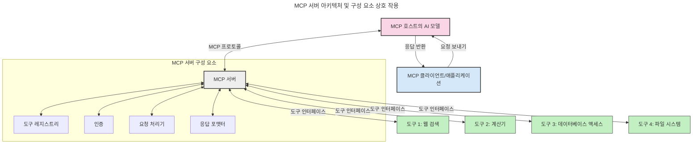
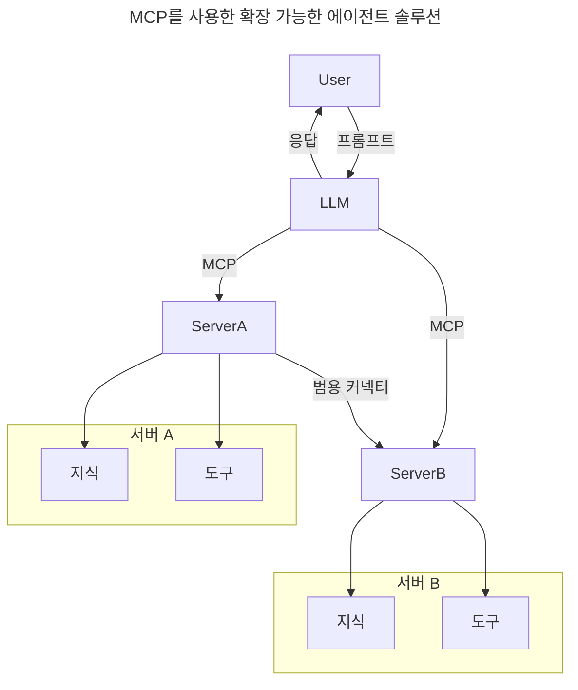
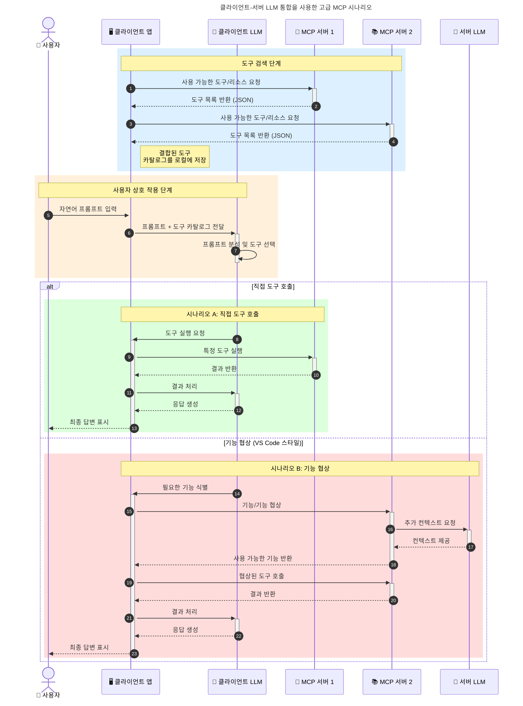

# 모델 컨텍스트 프로토콜(MCP) 소개: 확장 가능한 AI 애플리케이션에 중요한 이유

생성형 AI 애플리케이션은 사용자가 자연어 프롬프트를 사용하여 앱과 상호 작용할 수 있도록 해주기 때문에 큰 진일보입니다. 그러나 이러한 앱에 더 많은 시간과 리소스가 투자됨에 따라 기능을 쉽게 통합하고 리소스를 확장하기 쉬운 방식으로 통합하여 앱이 두 개 이상의 모델을 사용하고 다양한 모델의 복잡성을 처리할 수 있도록 해야 합니다. 즉, Gen AI 앱을 구축하는 것은 처음에는 쉽지만, 성장하고 복잡해짐에 따라 아키텍처를 정의해야 하며 앱이 일관된 방식으로 구축되도록 표준에 의존해야 할 가능성이 높습니다. 바로 이 지점에서 MCP가 모든 것을 정리하고 표준을 제공합니다.

---

## **🔍 모델 컨텍스트 프로토콜(MCP)이란 무엇인가요?**

**모델 컨텍스트 프로토콜(MCP)**은 대규모 언어 모델(LLM)이 외부 도구, API 및 데이터 소스와 원활하게 상호 작용할 수 있도록 하는 **개방형 표준 인터페이스**입니다. AI 모델의 기능을 학습 데이터를 넘어 향상시켜 더 스마트하고 확장 가능하며 응답성이 뛰어난 AI 시스템을 구현할 수 있는 일관된 아키텍처를 제공합니다.

---

## **🎯 AI 표준화가 중요한 이유**

생성형 AI 애플리케이션이 더욱 복잡해짐에 따라 **확장성, 확장성** 및 **유지 관리성**을 보장하는 표준을 채택하는 것이 중요합니다. MCP는 다음을 통해 이러한 요구 사항을 해결합니다.

- 모델-도구 통합 통합
- 취약하고 일회성인 맞춤형 솔루션 감소
- 하나의 생태계 내에서 여러 모델 공존 허용

---

## **📚 학습 목표**

이 글을 마치면 다음을 할 수 있게 됩니다.

- **모델 컨텍스트 프로토콜(MCP)** 및 사용 사례 정의
- MCP가 모델-도구 통신을 표준화하는 방법 이해
- MCP 아키텍처의 핵심 구성 요소 식별
- 엔터프라이즈 및 개발 컨텍스트에서 MCP의 실제 애플리케이션 탐색

---

## **💡 모델 컨텍스트 프로토콜(MCP)이 판도를 바꾸는 이유**

### **🔗 MCP는 AI 상호 작용의 파편화를 해결합니다**

MCP 이전에는 모델을 도구와 통합하려면 다음이 필요했습니다.

- 도구-모델 쌍당 맞춤형 코드
- 각 공급업체별 비표준 API
- 업데이트로 인한 잦은 중단
- 더 많은 도구로 인한 낮은 확장성

### **✅ MCP 표준화의 이점**

| **이점** | **설명** |
|---|---|
| 상호 운용성 | LLM은 여러 공급업체의 도구와 원활하게 작동합니다. |
| 일관성 | 플랫폼과 도구 전반에 걸쳐 균일한 동작 |
| 재사용성 | 한 번 구축된 도구는 여러 프로젝트와 시스템에서 사용할 수 있습니다. |
| 개발 가속화 | 표준화된 플러그 앤 플레이 인터페이스를 사용하여 개발 시간을 단축합니다. |

---

## **🧱 상위 수준 MCP 아키텍처 개요**

MCP는 **클라이언트-서버 모델**을 따릅니다.

- **MCP 호스트**는 AI 모델을 실행합니다.
- **MCP 클라이언트**는 요청을 시작합니다.
- **MCP 서버**는 컨텍스트, 도구 및 기능을 제공합니다.

### **주요 구성 요소:**

- **리소스** – 모델을 위한 정적 또는 동적 데이터
- **프롬프트** – 안내된 생성을 위한 사전 정의된 워크플로우
- **도구** – 검색, 계산과 같은 실행 가능한 기능
- **샘플링** – 재귀적 상호 작용을 통한 에이전트 동작

---

## MCP 서버 작동 방식

MCP 서버는 다음과 같은 방식으로 작동합니다.

- **요청 흐름**:
    1. MCP 클라이언트는 MCP 호스트에서 실행 중인 AI 모델에 요청을 보냅니다.
    2. AI 모델은 외부 도구나 데이터가 필요할 때를 식별합니다.
    3. 모델은 표준화된 프로토콜을 사용하여 MCP 서버와 통신합니다.

- **MCP 서버 기능**:
    - 도구 레지스트리: 사용 가능한 도구 및 해당 기능의 카탈로그를 유지 관리합니다.
    - 인증: 도구 액세스 권한을 확인합니다.
    - 요청 처리기: 모델에서 들어오는 도구 요청을 처리합니다.
    - 응답 포맷터: 모델이 이해할 수 있는 형식으로 도구 출력을 구성합니다.

- **도구 실행**:
    - 서버는 요청을 적절한 외부 도구로 라우팅합니다.
    - 도구는 특화된 기능(검색, 계산, 데이터베이스 쿼리 등)을 실행합니다.
    - 결과는 일관된 형식으로 모델에 반환됩니다.

- **응답 완료**:
    - AI 모델은 도구 출력을 응답에 통합합니다.
    - 최종 응답은 클라이언트 애플리케이션으로 다시 전송됩니다.

## 👨‍💻 MCP 서버 구축 방법 (예제 포함)

MCP 서버를 사용하면 데이터와 기능을 제공하여 LLM 기능을 확장할 수 있습니다.

준비되셨나요? 다음은 다양한 언어로 간단한 MCP 서버를 만드는 예제입니다.

- **Python 예제**: https://github.com/modelcontextprotocol/python-sdk

- **TypeScript 예제**: https://github.com/modelcontextprotocol/typescript-sdk

- **Java 예제**: https://github.com/modelcontextprotocol/java-sdk

- **C#/.NET 예제**: https://github.com/modelcontextprotocol/csharp-sdk

## 🌍 MCP의 실제 사용 사례

MCP는 AI 기능을 확장하여 다양한 애플리케이션을 지원합니다.

| **애플리케이션** | **설명** |
|---|---|
| 엔터프라이즈 데이터 통합 | LLM을 데이터베이스, CRM 또는 내부 도구에 연결합니다. |
| 에이전트 AI 시스템 | 도구 액세스 및 의사 결정 워크플로우를 통해 자율 에이전트를 활성화합니다. |
| 다중 모드 애플리케이션 | 단일 통합 AI 앱 내에서 텍스트, 이미지 및 오디오 도구를 결합합니다. |
| 실시간 데이터 통합 | AI 상호 작용에 실시간 데이터를 가져와 더 정확하고 최신 출력을 제공합니다. |

### 🧠 MCP = AI 상호 작용을 위한 보편적 표준

모델 컨텍스트 프로토콜(MCP)은 USB-C가 장치의 물리적 연결을 표준화한 것과 마찬가지로 AI 상호 작용을 위한 보편적 표준 역할을 합니다. AI 세계에서 MCP는 일관된 인터페이스를 제공하여 모델(클라이언트)이 외부 도구 및 데이터 공급자(서버)와 원활하게 통합할 수 있도록 합니다. 이를 통해 각 API 또는 데이터 소스에 대한 다양하고 맞춤형 프로토콜이 필요하지 않습니다.

MCP 하에서 MCP 호환 도구(MCP 서버라고 함)는 통합된 표준을 따릅니다. 이러한 서버는 제공하는 도구나 작업을 나열하고 AI 에이전트의 요청 시 해당 작업을 실행할 수 있습니다. MCP를 지원하는 AI 에이전트 플랫폼은 서버에서 사용 가능한 도구를 검색하고 이 표준 프로토콜을 통해 호출할 수 있습니다.

### 💡 지식에 대한 접근 촉진

도구를 제공하는 것 외에도 MCP는 지식에 대한 접근을 용이하게 합니다. 애플리케이션이 다양한 데이터 소스에 연결하여 대규모 언어 모델(LLM)에 컨텍스트를 제공할 수 있도록 합니다. 예를 들어, MCP 서버는 회사의 문서 저장소를 나타내어 에이전트가 필요에 따라 관련 정보를 검색할 수 있도록 할 수 있습니다. 다른 서버는 이메일 전송이나 레코드 업데이트와 같은 특정 작업을 처리할 수 있습니다. 에이전트의 관점에서 볼 때, 이것들은 단순히 사용할 수 있는 도구입니다. 일부 도구는 데이터(지식 컨텍스트)를 반환하고 다른 도구는 작업을 수행합니다. MCP는 이 두 가지를 효율적으로 관리합니다.

MCP 서버에 연결하는 에이전트는 표준 형식을 통해 서버의 사용 가능한 기능과 접근 가능한 데이터를 자동으로 학습합니다. 이 표준화는 동적 도구 가용성을 가능하게 합니다. 예를 들어, 에이전트 시스템에 새 MCP 서버를 추가하면 에이전트의 지침을 추가로 사용자 지정할 필요 없이 해당 기능이 즉시 사용 가능해집니다.

이 간소화된 통합은 머메이드 다이어그램에 묘사된 흐름과 일치하며, 서버는 도구와 지식을 모두 제공하여 시스템 간의 원활한 협업을 보장합니다.

### 👉 예제: 확장 가능한 에이전트 솔루션

### 🔄 클라이언트 측 LLM 통합을 사용한 고급 MCP 시나리오

기본 MCP 아키텍처 외에도 클라이언트와 서버 모두에 LLM이 포함되어 더 정교한 상호 작용을 가능하게 하는 고급 시나리오가 있습니다.

## 🔐 MCP의 실질적인 이점

MCP 사용의 실질적인 이점은 다음과 같습니다.

- **최신성**: 모델은 학습 데이터를 넘어 최신 정보에 액세스할 수 있습니다.
- **기능 확장**: 모델은 학습되지 않은 작업을 위해 특화된 도구를 활용할 수 있습니다.
- **환각 감소**: 외부 데이터 소스는 사실적 근거를 제공합니다.
- **개인 정보 보호**: 민감한 데이터는 프롬프트에 포함되지 않고 안전한 환경에 머물 수 있습니다.

## 📌 주요 내용

MCP 사용에 대한 주요 내용은 다음과 같습니다.

- **MCP**는 AI 모델이 도구 및 데이터와 상호 작용하는 방식을 표준화합니다.
- **확장성, 일관성 및 상호 운용성**을 촉진합니다.
- MCP는 **개발 시간을 단축하고 신뢰성을 향상시키며 모델 기능을 확장**하는 데 도움이 됩니다.
- 클라이언트-서버 아키텍처는 **유연하고 확장 가능한 AI 애플리케이션**을 가능하게 합니다.

## 🧠 연습 문제

구축에 관심 있는 AI 애플리케이션에 대해 생각해 보세요.

- 어떤 **외부 도구나 데이터**가 그 기능을 향상시킬 수 있을까요?
- MCP가 통합을 **더 간단하고 신뢰할 수 있게** 만드는 방법은 무엇일까요?

## 추가 리소스

- [MCP GitHub 저장소](https://github.com/modelcontextprotocol)

## 다음 내용

다음: [1장: 핵심 개념](../01-CoreConcepts/README.md)