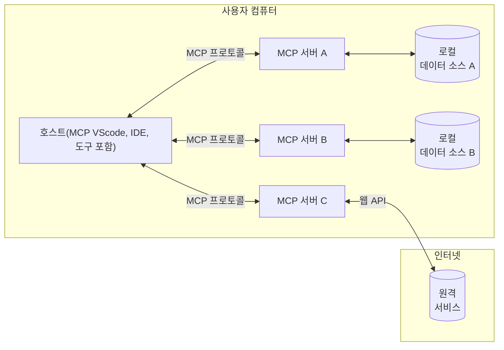

# 📖 MCP 핵심 개념: AI 통합을 위한 모델 컨텍스트 프로토콜 마스터하기

[모델 컨텍스트 프로토콜(MCP)](https://github.com/modelcontextprotocol)은 대규모 언어 모델(LLM)과 외부 도구, 애플리케이션 및 데이터 소스 간의 통신을 최적화하는 강력하고 표준화된 프레임워크입니다. 이 SEO에 최적화된 가이드는 MCP의 핵심 개념을 안내하여 클라이언트-서버 아키텍처, 필수 구성 요소, 통신 메커니즘 및 구현 모범 사례를 이해하도록 보장합니다.

## 개요

이 단원에서는 모델 컨텍스트 프로토콜(MCP) 생태계를 구성하는 기본 아키텍처와 구성 요소를 살펴봅니다. MCP 상호 작용을 지원하는 클라이언트-서버 아키텍처, 주요 구성 요소 및 통신 메커니즘에 대해 알아봅니다.

## 👩‍🎓 주요 학습 목표

이 단원을 마치면 다음을 수행할 수 있습니다.

- MCP 클라이언트-서버 아키텍처를 이해합니다.
- 호스트, 클라이언트 및 서버의 역할과 책임을 식별합니다.
- MCP를 유연한 통합 계층으로 만드는 핵심 기능을 분석합니다.
- MCP 생태계 내에서 정보가 흐르는 방식을 알아봅니다.
- .NET, Java, Python 및 JavaScript의 코드 예제를 통해 실용적인 통찰력을 얻습니다.

## 🔎 MCP 아키텍처: 심층 분석

MCP 생태계는 클라이언트-서버 모델을 기반으로 합니다. 이 모듈식 구조를 통해 AI 애플리케이션은 도구, 데이터베이스, API 및 컨텍스트 리소스와 효율적으로 상호 작용할 수 있습니다. 이 아키텍처를 핵심 구성 요소로 나누어 보겠습니다.

핵심적으로 MCP는 호스트 애플리케이션이 여러 서버에 연결할 수 있는 클라이언트-서버 아키텍처를 따릅니다.



- **MCP 호스트**: VSCode, Claude Desktop, IDE 또는 MCP를 통해 데이터에 액세스하려는 AI 도구와 같은 프로그램
- **MCP 클라이언트**: 서버와 1:1 연결을 유지하는 프로토콜 클라이언트
- **MCP 서버**: 표준화된 모델 컨텍스트 프로토콜을 통해 각각 특정 기능을 노출하는 경량 프로그램
- **로컬 데이터 소스**: MCP 서버가 안전하게 액세스할 수 있는 컴퓨터의 파일, 데이터베이스 및 서비스
- **원격 서비스**: MCP 서버가 API를 통해 연결할 수 있는 인터넷을 통해 사용 가능한 외부 시스템입니다.

MCP 프로토콜은 진화하는 표준이며 [프로토콜 사양](https://modelcontextprotocol.io/specification/2025-06-18/)에서 최신 업데이트를 볼 수 있습니다.

### 1. 호스트

모델 컨텍스트 프로토콜(MCP)에서 호스트는 사용자가 프로토콜과 상호 작용하는 기본 인터페이스로서 중요한 역할을 합니다. 호스트는 MCP 서버에 대한 연결을 시작하여 데이터, 도구 및 프롬프트에 액세스하는 애플리케이션 또는 환경입니다. 호스트의 예로는 Visual Studio Code와 같은 통합 개발 환경(IDE), Claude Desktop과 같은 AI 도구 또는 특정 작업을 위해 설계된 맞춤형 에이전트가 있습니다.

**호스트**는 연결을 시작하는 LLM 애플리케이션입니다. 다음을 수행합니다.

- 응답을 생성하기 위해 AI 모델을 실행하거나 상호 작용합니다.
- MCP 서버에 대한 연결을 시작합니다.
- 대화 흐름 및 사용자 인터페이스를 관리합니다.
- 권한 및 보안 제약 조건을 제어합니다.
- 데이터 공유 및 도구 실행에 대한 사용자 동의를 처리합니다.


### 2. 클라이언트

클라이언트는 호스트와 MCP 서버 간의 상호 작용을 용이하게 하는 필수 구성 요소입니다. 클라이언트는 중개자 역할을 하여 호스트가 MCP 서버에서 제공하는 기능에 액세스하고 활용할 수 있도록 합니다. MCP 아키텍처 내에서 원활한 통신과 효율적인 데이터 교환을 보장하는 데 중요한 역할을 합니다.

**클라이언트**는 호스트 애플리케이션 내의 커넥터입니다. 다음을 수행합니다.

- 프롬프트/지침과 함께 서버에 요청을 보냅니다.
- 서버와 기능을 협상합니다.
- 모델의 도구 실행 요청을 관리합니다.
- 사용자에게 응답을 처리하고 표시합니다.

### 3. 서버

서버는 MCP 클라이언트의 요청을 처리하고 적절한 응답을 제공하는 역할을 합니다. 데이터 검색, 도구 실행 및 프롬프트 생성과 같은 다양한 작업을 관리합니다. 서버는 클라이언트와 호스트 간의 통신이 효율적이고 안정적이며 상호 작용 프로세스의 무결성을 유지하도록 보장합니다.

**서버**는 컨텍스트와 기능을 제공하는 서비스입니다. 다음을 수행합니다.

- 사용 가능한 기능(리소스, 프롬프트, 도구)을 등록합니다.
- 클라이언트로부터 도구 호출을 수신하고 실행합니다.
- 모델 응답을 향상시키기 위해 컨텍스트 정보를 제공합니다.
- 출력을 클라이언트로 다시 반환합니다.
- 필요한 경우 상호 작용 전반에 걸쳐 상태를 유지합니다.

서버는 누구나 개발하여 특화된 기능으로 모델 기능을 확장할 수 있습니다.

### 4. 서버 기능

모델 컨텍스트 프로토콜(MCP)의 서버는 클라이언트, 호스트 및 언어 모델 간의 풍부한 상호 작용을 가능하게 하는 기본 빌딩 블록을 제공합니다. 이러한 기능은 구조화된 컨텍스트, 도구 및 프롬프트를 제공하여 MCP의 기능을 향상시키도록 설계되었습니다.

MCP 서버는 다음 기능 중 하나를 제공할 수 있습니다.

#### 📑 리소스

모델 컨텍스트 프로토콜(MCP)의 리소스는 사용자 또는 AI 모델이 활용할 수 있는 다양한 유형의 컨텍스트와 데이터를 포함합니다. 여기에는 다음이 포함됩니다.

- **컨텍스트 데이터**: 사용자 또는 AI 모델이 의사 결정 및 작업 실행에 활용할 수 있는 정보 및 컨텍스트입니다.
- **지식 기반 및 문서 저장소**: 귀중한 통찰력과 정보를 제공하는 기사, 설명서 및 연구 논문과 같은 구조화 및 비구조화 데이터 모음입니다.
- **로컬 파일 및 데이터베이스**: 장치 또는 데이터베이스 내에 로컬로 저장된 데이터로, 처리 및 분석을 위해 액세스할 수 있습니다.
- **API 및 웹 서비스**: 다양한 온라인 리소스 및 도구와의 통합을 가능하게 하는 추가 데이터 및 기능을 제공하는 외부 인터페이스 및 서비스입니다.

리소스의 예로는 다음과 같이 액세스할 수 있는 데이터베이스 스키마 또는 파일이 있습니다.

```text
file://log.txt
database://schema
```

### 🤖 프롬프트
모델 컨텍스트 프로토콜(MCP)의 프롬프트에는 사용자 워크플로우를 간소화하고 커뮤니케이션을 향상시키기 위해 설계된 다양한 사전 정의된 템플릿과 상호 작용 패턴이 포함됩니다. 여기에는 다음이 포함됩니다.

- **템플릿화된 메시지 및 워크플로우**: 특정 작업 및 상호 작용을 통해 사용자를 안내하는 사전 구조화된 메시지 및 프로세스입니다.
- **사전 정의된 상호 작용 패턴**: 일관되고 효율적인 커뮤니케이션을 용이하게 하는 표준화된 작업 및 응답 시퀀스입니다.
- **특화된 대화 템플릿**: 특정 유형의 대화에 맞게 조정된 사용자 정의 가능한 템플릿으로, 관련성 있고 상황에 맞는 상호 작용을 보장합니다.

프롬프트 템플릿은 다음과 같을 수 있습니다.

```markdown
Generate a product slogan based on the following {{product}} with the following {{keywords}}
```

#### ⛏️ 도구

모델 컨텍스트 프로토콜(MCP)의 도구는 AI 모델이 특정 작업을 수행하기 위해 실행할 수 있는 기능입니다. 이러한 도구는 구조화되고 신뢰할 수 있는 작업을 제공하여 AI 모델의 기능을 향상시키도록 설계되었습니다. 주요 측면은 다음과 같습니다.

- **AI 모델이 실행할 기능**: 도구는 AI 모델이 다양한 작업을 수행하기 위해 호출할 수 있는 실행 가능한 기능입니다.
- **고유한 이름 및 설명**: 각 도구에는 목적과 기능을 설명하는 고유한 이름과 자세한 설명이 있습니다.
- **매개변수 및 출력**: 도구는 특정 매개변수를 수락하고 구조화된 출력을 반환하여 일관되고 예측 가능한 결과를 보장합니다.
- **개별 기능**: 도구는 웹 검색, 계산 및 데이터베이스 쿼리와 같은 개별 기능을 수행합니다.

예제 도구는 다음과 같을 수 있습니다.

```typescript
server.tool(
  "GetProducts",
  {
    pageSize: z.string().optional(),
    pageCount: z.string().optional()
  }, () => {
    // API에서 결과 반환
  }
)
```

## 클라이언트 기능
모델 컨텍스트 프로토콜(MCP)에서 클라이언트는 서버에 몇 가지 주요 기능을 제공하여 프로토콜 내에서 전반적인 기능과 상호 작용을 향상시킵니다. 주목할 만한 기능 중 하나는 샘플링입니다.

### 👉 샘플링

- **서버 시작 에이전트 동작**: 클라이언트는 서버가 특정 작업이나 동작을 자율적으로 시작할 수 있도록 하여 시스템의 동적 기능을 향상시킵니다.
- **재귀적 LLM 상호 작용**: 이 기능을 사용하면 대규모 언어 모델(LLM)과 재귀적으로 상호 작용하여 더 복잡하고 반복적인 작업 처리가 가능합니다.
- **추가 모델 완성 요청**: 서버는 모델에서 추가 완성을 요청하여 응답이 철저하고 상황에 맞게 관련되도록 할 수 있습니다.

## MCP의 정보 흐름

모델 컨텍스트 프로토콜(MCP)은 호스트, 클라이언트, 서버 및 모델 간의 구조화된 정보 흐름을 정의합니다. 이 흐름을 이해하면 사용자 요청이 처리되는 방식과 외부 도구 및 데이터가 모델 응답에 통합되는 방식을 명확히 하는 데 도움이 됩니다.

- **호스트가 연결 시작**
  호스트 애플리케이션(예: IDE 또는 채팅 인터페이스)은 일반적으로 STDIO, WebSocket 또는 기타 지원되는 전송을 통해 MCP 서버에 대한 연결을 설정합니다.

- **기능 협상**
  클라이언트(호스트에 내장됨)와 서버는 지원되는 기능, 도구, 리소스 및 프로토콜 버전에 대한 정보를 교환합니다. 이를 통해 양측은 세션에 사용할 수 있는 기능을 이해할 수 있습니다.

- **사용자 요청**
  사용자는 호스트와 상호 작용합니다(예: 프롬프트 또는 명령 입력). 호스트는 이 입력을 수집하여 처리를 위해 클라이언트로 전달합니다.

- **리소스 또는 도구 사용**
  - 클라이언트는 모델의 이해를 풍부하게 하기 위해 서버에서 추가 컨텍스트 또는 리소스(예: 파일, 데이터베이스 항목 또는 지식 기반 문서)를 요청할 수 있습니다.
  - 모델이 도구가 필요하다고 판단하면(예: 데이터 가져오기, 계산 수행 또는 API 호출), 클라이언트는 도구 이름과 매개변수를 지정하여 서버에 도구 호출 요청을 보냅니다.

- **서버 실행**
  서버는 리소스 또는 도구 요청을 수신하고 필요한 작업(예: 함수 실행, 데이터베이스 쿼리 또는 파일 검색)을 실행한 다음 구조화된 형식으로 클라이언트에 결과를 반환합니다.

- **응답 생성**
  클라이언트는 서버의 응답(리소스 데이터, 도구 출력 등)을 진행 중인 모델 상호 작용에 통합합니다. 모델은 이 정보를 사용하여 포괄적이고 상황에 맞는 응답을 생성합니다.

- **결과 표시**
  호스트는 클라이언트로부터 최종 출력을 수신하여 사용자에게 표시하며, 종종 모델에서 생성된 텍스트와 도구 실행 또는 리소스 조회 결과를 모두 포함합니다.

이 흐름을 통해 MCP는 모델을 외부 도구 및 데이터 소스와 원활하게 연결하여 고급, 대화형 및 컨텍스트 인식 AI 애플리케이션을 지원할 수 있습니다.

## 프로토콜 세부 정보

MCP(모델 컨텍스트 프로토콜)는 [JSON-RPC 2.0](https://www.jsonrpc.org/)을 기반으로 구축되어 호스트, 클라이언트 및 서버 간의 통신을 위한 표준화되고 언어에 구애받지 않는 메시지 형식을 제공합니다. 이 기반은 다양한 플랫폼과 프로그래밍 언어에서 안정적이고 구조화되었으며 확장 가능한 상호 작용을 가능하게 합니다.

### 주요 프로토콜 기능

MCP는 도구 호출, 리소스 액세스 및 프롬프트 관리를 위한 추가 규칙으로 JSON-RPC 2.0을 확장합니다. 여러 전송 계층(STDIO, WebSocket, SSE)을 지원하며 구성 요소 간에 안전하고 확장 가능하며 언어에 구애받지 않는 통신을 가능하게 합니다.

#### 🧢 기본 프로토콜

- **JSON-RPC 메시지 형식**: 모든 요청과 응답은 JSON-RPC 2.0 사양을 사용하여 메서드 호출, 매개변수, 결과 및 오류 처리를 위한 일관된 구조를 보장합니다.
- **상태 저장 연결**: MCP 세션은 여러 요청에 걸쳐 상태를 유지하여 진행 중인 대화, 컨텍스트 누적 및 리소스 관리를 지원합니다.
- **기능 협상**: 연결 설정 중에 클라이언트와 서버는 지원되는 기능, 프로토콜 버전, 사용 가능한 도구 및 리소스에 대한 정보를 교환합니다. 이를 통해 양측은 서로의 기능을 이해하고 그에 따라 적응할 수 있습니다.

#### ➕ 추가 유틸리티

다음은 MCP가 개발자 경험을 향상시키고 고급 시나리오를 가능하게 하기 위해 제공하는 몇 가지 추가 유틸리티 및 프로토콜 확장입니다.

- **구성 옵션**: MCP는 각 상호 작용에 맞게 조정된 도구 권한, 리소스 액세스 및 모델 설정과 같은 세션 매개변수의 동적 구성을 허용합니다.
- **진행률 추적**: 장기 실행 작업은 진행률 업데이트를 보고하여 복잡한 작업 중에 응답성이 뛰어난 사용자 인터페이스와 더 나은 사용자 경험을 가능하게 합니다.
- **요청 취소**: 클라이언트는 진행 중인 요청을 취소하여 사용자가 더 이상 필요하지 않거나 너무 오래 걸리는 작업을 중단할 수 있도록 합니다.
- **오류 보고**: 표준화된 오류 메시지 및 코드는 문제를 진단하고, 오류를 정상적으로 처리하며, 사용자 및 개발자에게 실행 가능한 피드백을 제공하는 데 도움이 됩니다.
- **로깅**: 클라이언트와 서버 모두 프로토콜 상호 작용을 감사, 디버깅 및 모니터링하기 위해 구조화된 로그를 내보낼 수 있습니다.

이러한 프로토콜 기능을 활용하여 MCP는 언어 모델과 외부 도구 또는 데이터 소스 간의 강력하고 안전하며 유연한 통신을 보장합니다.

### 🔐 보안 고려 사항

MCP 구현은 안전하고 신뢰할 수 있는 상호 작용을 보장하기 위해 몇 가지 주요 보안 원칙을 준수해야 합니다.

- **사용자 동의 및 제어**: 사용자는 데이터에 액세스하거나 작업을 수행하기 전에 명시적인 동의를 제공해야 합니다. 사용자는 공유되는 데이터와 승인된 작업을 명확하게 제어할 수 있어야 하며, 활동을 검토하고 승인하기 위한 직관적인 사용자 인터페이스가 지원되어야 합니다.

- **데이터 개인 정보 보호**: 사용자 데이터는 명시적인 동의가 있는 경우에만 노출되어야 하며 적절한 액세스 제어로 보호되어야 합니다. MCP 구현은 무단 데이터 전송을 방지하고 모든 상호 작용에서 개인 정보 보호가 유지되도록 해야 합니다.

- **도구 안전**: 도구를 호출하기 전에 명시적인 사용자 동의가 필요합니다. 사용자는 각 도구의 기능을 명확하게 이해해야 하며, 의도하지 않거나 안전하지 않은 도구 실행을 방지하기 위해 강력한 보안 경계가 적용되어야 합니다.

이러한 원칙을 따르면 MCP는 모든 프로토콜 상호 작용에서 사용자 신뢰, 개인 정보 보호 및 안전이 유지되도록 보장합니다.

## 코드 예제: 주요 구성 요소

다음은 주요 MCP 서버 구성 요소 및 도구를 구현하는 방법을 보여주는 여러 인기 있는 프로그래밍 언어의 코드 예제입니다.

### .NET 예제: 도구가 포함된 간단한 MCP 서버 만들기

다음은 사용자 지정 도구가 포함된 간단한 MCP 서버를 구현하는 방법을 보여주는 실용적인 .NET 코드 예제입니다. 이 예제에서는 도구를 정의 및 등록하고, 요청을 처리하고, 모델 컨텍스트 프로토콜을 사용하여 서버를 연결하는 방법을 보여줍니다.

```csharp
using System;
using System.Threading.Tasks;
using ModelContextProtocol.Server;
using ModelContextProtocol.Server.Transport;
using ModelContextProtocol.Server.Tools;

public class WeatherServer
{
    public static async Task Main(string[] args)
    {
        // MCP 서버 만들기
        var server = new McpServer(
            name: "Weather MCP Server",
            version: "1.0.0"
        );
        
        // 사용자 지정 날씨 도구 등록
        server.AddTool<string, WeatherData>("weatherTool", 
            description: "위치에 대한 현재 날씨를 가져옵니다",
            execute: async (location) => {
                // 날씨 API 호출 (간소화됨)
                var weatherData = await GetWeatherDataAsync(location);
                return weatherData;
            });
        
        // stdio 전송을 사용하여 서버 연결
        var transport = new StdioServerTransport();
        await server.ConnectAsync(transport);
        
        Console.WriteLine("Weather MCP Server started");
        
        // 프로세스가 종료될 때까지 서버 실행 유지
        await Task.Delay(-1);
    }
    
    private static async Task<WeatherData> GetWeatherDataAsync(string location)
    {
        // 일반적으로 날씨 API를 호출합니다.
        // 데모용으로 간소화됨
        await Task.Delay(100); // API 호출 시뮬레이션
        return new WeatherData { 
            Temperature = 72.5,
            Conditions = "Sunny",
            Location = location
        };
    }
}

public class WeatherData
{
    public double Temperature { get; set; }
    public string Conditions { get; set; }
    public string Location { get; set; }
}
```

### Java 예제: MCP 서버 구성 요소

이 예제는 위 .NET 예제와 동일한 MCP 서버 및 도구 등록을 보여주지만 Java로 구현되었습니다.

```java
import io.modelcontextprotocol.server.McpServer;
import io.modelcontextprotocol.server.McpToolDefinition;
import io.modelcontextprotocol.server.transport.StdioServerTransport;
import io.modelcontextprotocol.server.tool.ToolExecutionContext;
import io.modelcontextprotocol.server.tool.ToolResponse;

public class WeatherMcpServer {
    public static void main(String[] args) throws Exception {
        // MCP 서버 만들기
        McpServer server = McpServer.builder()
            .name("Weather MCP Server")
            .version("1.0.0")
            .build();
            
        // 날씨 도구 등록
        server.registerTool(McpToolDefinition.builder("weatherTool")
            .description("위치에 대한 현재 날씨를 가져옵니다")
            .parameter("location", String.class)
            .execute((ToolExecutionContext ctx) -> {
                String location = ctx.getParameter("location", String.class);
                
                // 날씨 데이터 가져오기 (간소화됨)
                WeatherData data = getWeatherData(location);
                
                // 형식화된 응답 반환
                return ToolResponse.content(
                    String.format("온도: %.1f°F, 상태: %s, 위치: %s", 
                    data.getTemperature(), 
                    data.getConditions(), 
                    data.getLocation())
                );
            })
            .build());
        
        // stdio 전송을 사용하여 서버 연결
        try (StdioServerTransport transport = new StdioServerTransport()) {
            server.connect(transport);
            System.out.println("Weather MCP Server started");
            // 프로세스가 종료될 때까지 서버 실행 유지
            Thread.currentThread().join();
        }
    }
    
    private static WeatherData getWeatherData(String location) {
        // 구현 시 날씨 API를 호출합니다.
        // 예제용으로 간소화됨
        return new WeatherData(72.5, "Sunny", location);
    }
}

class WeatherData {
    private double temperature;
    private String conditions;
    private String location;
    
    public WeatherData(double temperature, String conditions, String location) {
        this.temperature = temperature;
        this.conditions = conditions;
        this.location = location;
    }
    
    public double getTemperature() {
        return temperature;
    }
    
    public String getConditions() {
        return conditions;
    }
    
    public String getLocation() {
        return location;
    }
}
```

### Python 예제: MCP 서버 구축

이 예제에서는 Python으로 MCP 서버를 구축하는 방법을 보여줍니다. 또한 도구를 만드는 두 가지 다른 방법을 보여줍니다.

```python
#!/usr/bin/env python3
import asyncio
from mcp.server.fastmcp import FastMCP
from mcp.server.transports.stdio import serve_stdio

# FastMCP 서버 만들기
mcp = FastMCP(
    name="Weather MCP Server",
    version="1.0.0"
)

@mcp.tool()
def get_weather(location: str) -> dict:
    """위치에 대한 현재 날씨를 가져옵니다."""
    # 일반적으로 날씨 API를 호출합니다.
    # 데모용으로 간소화됨
    return {
        "temperature": 72.5,
        "conditions": "Sunny",
        "location": location
    }

# 클래스를 사용하는 대체 접근 방식
class WeatherTools:
    @mcp.tool()
    def forecast(self, location: str, days: int = 1) -> dict:
        """지정된 일수 동안 위치에 대한 날씨 예보를 가져옵니다."""
        # 일반적으로 날씨 API 예보 엔드포인트를 호출합니다.
        # 데모용으로 간소화됨
        return {
            "location": location,
            "forecast": [
                {"day": i+1, "temperature": 70 + i, "conditions": "Partly Cloudy"}
                for i in range(days)
            ]
        }

# 도구를 등록하기 위해 클래스 인스턴스화
weather_tools = WeatherTools()

# stdio 전송을 사용하여 서버 시작
if __name__ == "__main__":
    asyncio.run(serve_stdio(mcp))
```

### JavaScript 예제: MCP 서버 만들기

이 예제는 JavaScript에서 MCP 서버를 만들고 두 개의 날씨 관련 도구를 등록하는 방법을 보여줍니다.

```javascript
// 공식 모델 컨텍스트 프로토콜 SDK 사용
import { McpServer } from "@modelcontextprotocol/sdk/server/mcp.js";
import { StdioServerTransport } from "@modelcontextprotocol/sdk/server/stdio.js";
import { z } from "zod"; // 매개변수 유효성 검사를 위해

// MCP 서버 만들기
const server = new McpServer({
  name: "Weather MCP Server",
  version: "1.0.0"
});

// 날씨 도구 정의
server.tool(
  "weatherTool",
  {
    location: z.string().describe("날씨를 가져올 위치")
  },
  async ({ location }) => {
    // 일반적으로 날씨 API를 호출합니다.
    // 데모용으로 간소화됨
    const weatherData = await getWeatherData(location);
    
    return {
      content: [
        { 
          type: "text", 
          text: `온도: ${weatherData.temperature}°F, 상태: ${weatherData.conditions}, 위치: ${weatherData.location}` 
        }
      ]
    };
  }
);

// 예보 도구 정의
server.tool(
  "forecastTool",
  {
    location: z.string(),
    days: z.number().default(3).describe("예보 일수")
  },
  async ({ location, days }) => {
    // 일반적으로 날씨 API를 호출합니다.
    // 데모용으로 간소화됨
    const forecast = await getForecastData(location, days);
    
    return {
      content: [
        { 
          type: "text", 
          text: `${days}일 동안의 ${location} 예보: ${JSON.stringify(forecast)}` 
        }
      ]
    };
  }
);

// 도우미 함수
async function getWeatherData(location) {
  // API 호출 시뮬레이션
  return {
    temperature: 72.5,
    conditions: "Sunny",
    location: location
  };
}

async function getForecastData(location, days) {
  // API 호출 시뮬레이션
  return Array.from({ length: days }, (_, i) => ({
    day: i + 1,
    temperature: 70 + Math.floor(Math.random() * 10),
    conditions: i % 2 === 0 ? "Sunny" : "Partly Cloudy"
  }));
}

// stdio 전송을 사용하여 서버 연결
const transport = new StdioServerTransport();
server.connect(transport).catch(console.error);

console.log("Weather MCP Server started");
```

이 JavaScript 예제는 서버에 연결하고, 프롬프트를 보내고, 수행된 모든 도구 호출을 포함한 응답을 처리하는 MCP 클라이언트를 만드는 방법을 보여줍니다.

## 보안 및 권한 부여

MCP는 프로토콜 전반에 걸쳐 보안 및 권한 부여를 관리하기 위한 몇 가지 내장된 개념과 메커니즘을 포함합니다.

1. **도구 권한 제어**:
  클라이언트는 세션 중에 모델이 사용할 수 있는 도구를 지정할 수 있습니다. 이를 통해 명시적으로 승인된 도구만 액세스할 수 있으므로 의도하지 않거나 안전하지 않은 작업의 위험을 줄일 수 있습니다. 권한은 사용자 기본 설정, 조직 정책 또는 상호 작용의 컨텍스트에 따라 동적으로 구성할 수 있습니다.

2. **인증**:
  서버는 도구, 리소스 또는 민감한 작업에 대한 액세스 권한을 부여하기 전에 인증을 요구할 수 있습니다. 여기에는 API 키, OAuth 토큰 또는 기타 인증 체계가 포함될 수 있습니다. 적절한 인증은 신뢰할 수 있는 클라이언트와 사용자만 서버 측 기능을 호출할 수 있도록 보장합니다.

3. **유효성 검사**:
  모든 도구 호출에 대해 매개변수 유효성 검사가 적용됩니다. 각 도구는 매개변수에 대한 예상 유형, 형식 및 제약 조건을 정의하며 서버는 들어오는 요청을 그에 따라 유효성을 검사합니다. 이를 통해 잘못된 형식이나 악의적인 입력이 도구 구현에 도달하는 것을 방지하고 작업의 무결성을 유지하는 데 도움이 됩니다.

4. **속도 제한**:
  남용을 방지하고 서버 리소스의 공정한 사용을 보장하기 위해 MCP 서버는 도구 호출 및 리소스 액세스에 대한 속도 제한을 구현할 수 있습니다. 속도 제한은 사용자별, 세션별 또는 전역적으로 적용될 수 있으며 서비스 거부 공격이나 과도한 리소스 소비로부터 보호하는 데 도움이 됩니다.

이러한 메커니즘을 결합하여 MCP는 언어 모델을 외부 도구 및 데이터 소스와 통합하기 위한 안전한 기반을 제공하는 동시에 사용자 및 개발자에게 액세스 및 사용에 대한 세분화된 제어 권한을 부여합니다.

## 프로토콜 메시지

MCP 통신은 클라이언트, 서버 및 모델 간의 명확하고 신뢰할 수 있는 상호 작용을 용이하게 하기 위해 구조화된 JSON 메시지를 사용합니다. 주요 메시지 유형은 다음과 같습니다.

- **클라이언트 요청**
  클라이언트에서 서버로 전송되는 이 메시지에는 일반적으로 다음이 포함됩니다.
  - 사용자의 프롬프트 또는 명령
  - 컨텍스트에 대한 대화 기록
  - 도구 구성 및 권한
  - 추가 메타데이터 또는 세션 정보

- **모델 응답**
  모델에서 반환되는(클라이언트를 통해) 이 메시지에는 다음이 포함됩니다.
  - 프롬프트 및 컨텍스트를 기반으로 생성된 텍스트 또는 완성
  - 모델이 도구를 호출해야 한다고 판단하는 경우 선택적 도구 호출 지침
  - 필요에 따라 리소스 또는 추가 컨텍스트에 대한 참조

- **도구 요청**
  도구를 실행해야 할 때 클라이언트에서 서버로 전송됩니다. 이 메시지에는 다음이 포함됩니다.
  - 호출할 도구의 이름
  - 매개변수(도구의 스키마에 대해 유효성 검사됨)
  - 요청 추적을 위한 컨텍스트 정보 또는 식별자

- **도구 응답**
  도구를 실행한 후 서버에서 반환됩니다. 이 메시지는 다음을 제공합니다.
  - 도구 실행 결과(구조화된 데이터 또는 콘텐츠)
  - 도구 호출이 실패한 경우 오류 또는 상태 정보
  - 선택적으로 실행과 관련된 추가 메타데이터 또는 로그

이러한 구조화된 메시지는 MCP 워크플로우의 각 단계가 명시적이고 추적 가능하며 확장 가능하도록 보장하여 다중 턴 대화, 도구 체인 및 강력한 오류 처리와 같은 고급 시나리오를 지원합니다.

## 주요 내용

- MCP는 클라이언트-서버 아키텍처를 사용하여 모델을 외부 기능과 연결합니다.
- 생태계는 클라이언트, 호스트, 서버, 도구 및 데이터 소스로 구성됩니다.
- 통신은 STDIO, SSE 또는 WebSocket을 통해 발생할 수 있습니다.
- 도구는 모델에 노출되는 기능의 기본 단위입니다.
- 구조화된 통신 프로토콜은 일관된 상호 작용을 보장합니다.

## 연습 문제

도메인에서 유용할 간단한 MCP 도구를 설계하세요. 다음을 정의하세요.
1. 도구의 이름
2. 수락할 매개변수
3. 반환할 출력
4. 모델이 이 도구를 사용하여 사용자 문제를 해결하는 방법


---

## 다음 내용

다음: [2장: 보안](../02-Security/README.md)