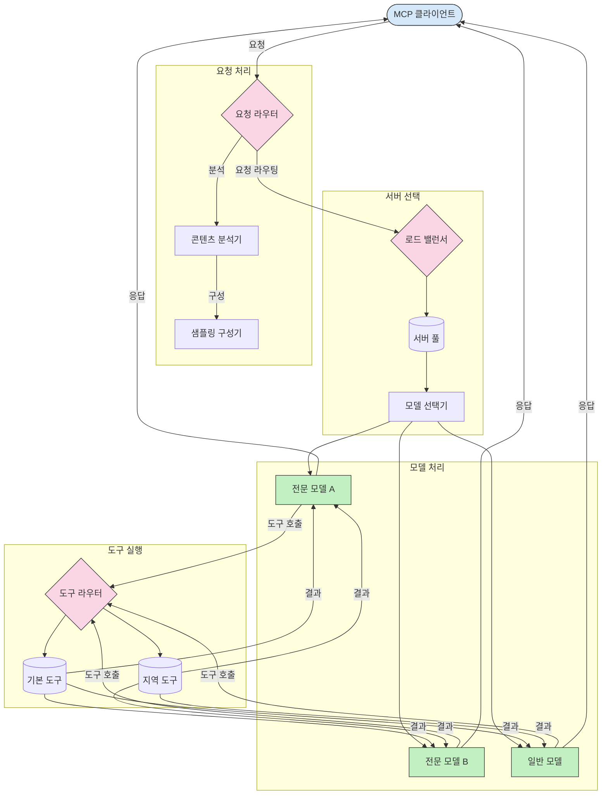

## 모델 컨텍스트 프로토콜의 라우팅

라우팅은 MCP 생태계 내에서 요청을 적절한 모델, 도구 또는 서비스로 전달하는 데 필수적입니다.

## 소개

모델 컨텍스트 프로토콜(MCP)의 라우팅은 콘텐츠 유형, 사용자 컨텍스트 및 시스템 로드와 같은 다양한 기준에 따라 요청을 가장 적합한 모델 또는 서비스로 전달하는 것을 포함합니다. 이는 효율적인 처리와 최적의 리소스 활용을 보장합니다.

## 학습 목표

이 단원을 마치면 다음을 수행할 수 있습니다:

- MCP에서 라우팅의 원리 이해
- 콘텐츠 기반 라우팅을 구현하여 요청을 전문 서비스로 전달
- 지능형 로드 밸런싱 전략을 적용하여 리소스 활용 최적화
- 요청 컨텍스트에 기반한 동적 도구 라우팅 구현

## 콘텐츠 기반 라우팅

콘텐츠 기반 라우팅은 요청의 콘텐츠를 기반으로 요청을 전문 서비스로 전달합니다. 예를 들어, 코드 생성과 관련된 요청은 전문 코드 모델로 라우팅될 수 있고, 창의적 글쓰기 요청은 창의적 글쓰기 모델로 전송될 수 있습니다.

다양한 프로그래밍 언어로 된 구현 예시를 살펴보겠습니다.

<details>
<summary>.NET</summary>

```csharp
// .NET 예시: MCP의 콘텐츠 기반 라우팅
public class ContentBasedRouter
{
    private readonly Dictionary<string, McpClient> _specializedClients;
    private readonly RoutingClassifier _classifier;
    
    public ContentBasedRouter()
    {
        // 다양한 도메인을 위한 전문 클라이언트 초기화
        _specializedClients = new Dictionary<string, McpClient>
        {
            ["code"] = new McpClient("https://code-specialized-mcp.com"),
            ["creative"] = new McpClient("https://creative-specialized-mcp.com"),
            ["scientific"] = new McpClient("https://scientific-specialized-mcp.com"),
            ["general"] = new McpClient("https://general-mcp.com")
        };
        
        // 콘텐츠 분류기 초기화
        _classifier = new RoutingClassifier();
    }
    
    public async Task<McpResponse> RouteAndProcessAsync(string prompt, IDictionary<string, object> parameters = null)
    {
        // 최상의 전문 서비스를 결정하기 위해 프롬프트 분류
        string category = await _classifier.ClassifyPromptAsync(prompt);
        
        // 적절한 클라이언트 가져오기 또는 일반 클라이언트로 폴백
        var client = _specializedClients.ContainsKey(category) 
            ? _specializedClients[category] 
            : _specializedClients["general"];
            
        Console.WriteLine($"요청을 {category} 전문 서비스로 라우팅 중");
        
        // 선택한 서비스로 요청 전송
        return await client.SendPromptAsync(prompt, parameters);
    }
    
    // 라우팅 결정을 위한 간단한 분류기
    private class RoutingClassifier
    {
        public Task<string> ClassifyPromptAsync(string prompt)
        {
            prompt = prompt.ToLowerInvariant();
            
            if (prompt.Contains("code") || prompt.Contains("function") || 
                prompt.Contains("program") || prompt.Contains("algorithm"))
            {
                return Task.FromResult("code");
            }
            
            if (prompt.Contains("story") || prompt.Contains("creative") || 
                prompt.Contains("imagine") || prompt.Contains("design"))
            {
                return Task.FromResult("creative");
            }
            
            if (prompt.Contains("science") || prompt.Contains("research") || 
                prompt.Contains("analyze") || prompt.Contains("study"))
            {
                return Task.FromResult("scientific");
            }
            
            return Task.FromResult("general");
        }
    }
}
```

위 코드에서 다음을 수행했습니다:

- 프롬프트의 콘텐츠를 기반으로 요청을 라우팅하는 `ContentBasedRouter` 클래스를 생성했습니다.
- 다양한 도메인(코드, 창의적, 과학적, 일반)을 위한 전문 클라이언트를 초기화했습니다.
- 프롬프트의 범주를 결정하고 적절한 전문 서비스로 라우팅하는 간단한 분류기를 구현했습니다.
- 전문 서비스가 없는 경우 요청을 일반 서비스로 라우팅하는 폴백 메커니즘을 사용했습니다.
- 요청을 효율적으로 처리하기 위해 비동기 처리를 구현했습니다.
- 콘텐츠 범주를 전문 MCP 클라이언트에 매핑하는 사전을 사용했습니다.
- 프롬프트를 분석하고 적절한 범주를 반환하는 간단한 분류기를 구현했습니다.
- 전문 클라이언트를 사용하여 요청을 전송하고 응답을 수신했습니다.
- 프롬프트가 전문 범주와 일치하지 않는 경우 일반 서비스로 라우팅하여 처리했습니다.

</details>

## 지능형 로드 밸런싱

로드 밸런싱은 리소스 활용을 최적화하고 MCP 서비스의 고가용성을 보장합니다. 라운드 로빈, 가중 응답 시간 또는 콘텐츠 인식 전략과 같은 다양한 방식으로 로드 밸런싱을 구현할 수 있습니다.

다음 전략을 사용하는 아래 구현 예시를 살펴보겠습니다:

- **라운드 로빈**: 사용 가능한 서버에 요청을 균등하게 분산합니다.
- **가중 응답 시간**: 평균 응답 시간을 기반으로 서버에 요청을 라우팅합니다.
- **콘텐츠 인식**: 요청의 콘텐츠를 기반으로 전문 서버에 요청을 라우팅합니다.

<details>
<summary>Java</summary>

```java
// Java 예시: MCP 서버를 위한 지능형 로드 밸런싱
public class McpLoadBalancer {
    private final List<McpServerNode> serverNodes;
    private final LoadBalancingStrategy strategy;
    
    public McpLoadBalancer(List<McpServerNode> nodes, LoadBalancingStrategy strategy) {
        this.serverNodes = new ArrayList<>(nodes);
        this.strategy = strategy;
    }
    
    public McpResponse processRequest(McpRequest request) {
        // 전략에 따라 최상의 서버 선택
        McpServerNode selectedNode = strategy.selectNode(serverNodes, request);
        
        try {
            // 선택한 노드로 요청 라우팅
            return selectedNode.processRequest(request);
        } catch (Exception e) {
            // 실패 처리 - 재시도 또는 폴백 논리 구현
            System.err.println("노드 " + selectedNode.getId() + "에서 요청 처리 오류: " + e.getMessage());
            
            // 노드를 잠재적으로 비정상으로 표시
            selectedNode.recordFailure();
            
            // 폴백으로 다음 최상의 노드 시도
            List<McpServerNode> remainingNodes = new ArrayList<>(serverNodes);
            remainingNodes.remove(selectedNode);
            
            if (!remainingNodes.isEmpty()) {
                McpServerNode fallbackNode = strategy.selectNode(remainingNodes, request);
                return fallbackNode.processRequest(request);
            } else {
                throw new RuntimeException("모든 MCP 서버 노드가 요청을 처리하지 못했습니다.");
            }
        }
    }
    
    // 노드 상태 확인 작업
    public void startHealthChecks(Duration interval) {
        ScheduledExecutorService scheduler = Executors.newScheduledThreadPool(1);
        scheduler.scheduleAtFixedRate(() -> {
            for (McpServerNode node : serverNodes) {
                try {
                    boolean isHealthy = node.checkHealth();
                    System.out.println("노드 " + node.getId() + " 상태: " + 
                                      (isHealthy ? "정상" : "비정상"));
                } catch (Exception e) {
                    System.err.println("노드 " + node.getId() + "에 대한 상태 확인 실패");
                    node.setHealthy(false);
                }
            }
        }, 0, interval.toMillis(), TimeUnit.MILLISECONDS);
    }
    
    // 로드 밸런싱 전략을 위한 인터페이스
    public interface LoadBalancingStrategy {
        McpServerNode selectNode(List<McpServerNode> nodes, McpRequest request);
    }
    
    // 라운드 로빈 전략
    public static class RoundRobinStrategy implements LoadBalancingStrategy {
        private AtomicInteger counter = new AtomicInteger(0);
        
        @Override
        public McpServerNode selectNode(List<McpServerNode> nodes, McpRequest request) {
            List<McpServerNode> healthyNodes = nodes.stream()
                .filter(McpServerNode::isHealthy)
                .collect(Collectors.toList());
            
            if (healthyNodes.isEmpty()) {
                throw new RuntimeException("사용 가능한 정상 노드가 없습니다.");
            }
            
            int index = counter.getAndIncrement() % healthyNodes.size();
            return healthyNodes.get(index);
        }
    }
    
    // 가중 응답 시간 전략
    public static class ResponseTimeStrategy implements LoadBalancingStrategy {
        @Override
        public McpServerNode selectNode(List<McpServerNode> nodes, McpRequest request) {
            return nodes.stream()
                .filter(McpServerNode::isHealthy)
                .min(Comparator.comparing(McpServerNode::getAverageResponseTime))
                .orElseThrow(() -> new RuntimeException("사용 가능한 정상 노드가 없습니다."));
        }
    }
    
    // 콘텐츠 인식 전략
    public static class ContentAwareStrategy implements LoadBalancingStrategy {
        @Override
        public McpServerNode selectNode(List<McpServerNode> nodes, McpRequest request) {
            // 요청 특성 결정
            boolean isCodeRequest = request.getPrompt().contains("code") || 
                                   request.getAllowedTools().contains("codeInterpreter");
            
            boolean isCreativeRequest = request.getPrompt().contains("creative") || 
                                       request.getPrompt().contains("story");
            
            // 전문 노드 찾기
            Optional<McpServerNode> specializedNode = nodes.stream()
                .filter(McpServerNode::isHealthy)
                .filter(node -> {
                    if (isCodeRequest && node.getSpecialization().equals("code")) {
                        return true;
                    }
                    if (isCreativeRequest && node.getSpecialization().equals("creative")) {
                        return true;
                    }
                    return false;
                })
                .findFirst();
            
            // 전문 노드 또는 가장 적게 로드된 노드 반환
            return specializedNode.orElse(
                nodes.stream()
                    .filter(McpServerNode::isHealthy)
                    .min(Comparator.comparing(McpServerNode::getCurrentLoad))
                    .orElseThrow(() -> new RuntimeException("사용 가능한 정상 노드가 없습니다."))
            );
        }
    }
}
```

위 코드에서 다음을 수행했습니다:

- MCP 서버 노드 목록을 관리하고 선택한 로드 밸런싱 전략에 따라 요청을 라우팅하는 `McpLoadBalancer` 클래스를 생성했습니다.
- `RoundRobinStrategy`, `ResponseTimeStrategy`, `ContentAwareStrategy`와 같은 다양한 로드 밸런싱 전략을 구현했습니다.
- `ScheduledExecutorService`를 사용하여 서버 노드의 상태를 주기적으로 확인했습니다.
- 상태 확인 응답을 기반으로 노드를 정상 또는 비정상으로 표시하는 상태 확인 메커니즘을 구현했습니다.
- 고가용성을 보장하기 위해 오류 처리 및 폴백 논리를 사용하여 요청 처리를 처리했습니다.
- `McpServerNode` 클래스를 사용하여 개별 MCP 서버 노드를 나타냈으며, 여기에는 상태, 평균 응답 시간 및 현재 로드가 포함됩니다.
- 프롬프트 및 허용된 도구와 같은 요청 세부 정보를 캡슐화하는 `McpRequest` 클래스를 구현했습니다.
- Java 스트림을 사용하여 상태 및 전문화에 따라 노드를 필터링하고 선택했습니다.

</details>

## 동적 도구 라우팅

도구 라우팅은 컨텍스트에 따라 도구 호출이 가장 적절한 서비스로 전달되도록 합니다. 예를 들어, 날씨 도구 호출은 사용자 위치에 따라 지역 엔드포인트로 라우팅되어야 할 수 있으며, 계산기 도구는 특정 버전의 API를 사용해야 할 수 있습니다.

요청 분석, 지역 엔드포인트 및 버전 관리 지원을 기반으로 동적 도구 라우팅을 시연하는 구현 예시를 살펴보겠습니다.

<details>
<summary>Python</summary>

```python
# Python 예시: 요청 분석에 기반한 동적 도구 라우팅
class McpToolRouter:
    def __init__(self):
        # 사용 가능한 도구 엔드포인트 등록
        self.tool_endpoints = {
            "weatherTool": "https://weather-service.example.com/api",
            "calculatorTool": "https://calculator-service.example.com/compute",
            "databaseTool": "https://database-service.example.com/query",
            "searchTool": "https://search-service.example.com/search"
        }
        
        # 전역 배포를 위한 지역 엔드포인트
        self.regional_endpoints = {
            "us": {
                "weatherTool": "https://us-west.weather-service.example.com/api",
                "searchTool": "https://us.search-service.example.com/search"
            },
            "europe": {
                "weatherTool": "https://eu.weather-service.example.com/api",
                "searchTool": "https://eu.search-service.example.com/search"
            },
            "asia": {
                "weatherTool": "https://asia.weather-service.example.com/api",
                "searchTool": "https://asia.search-service.example.com/search"
            }
        }
        
        # 도구 버전 관리 지원
        self.tool_versions = {
            "weatherTool": {
                "default": "v2",
                "v1": "https://weather-service.example.com/api/v1",
                "v2": "https://weather-service.example.com/api/v2",
                "beta": "https://weather-service.example.com/api/beta"
            }
        }
    
    async def route_tool_request(self, tool_name, parameters, user_context=None):
        """컨텍스트에 따라 적절한 엔드포인트로 도구 요청 라우팅"""
        endpoint = self._select_endpoint(tool_name, parameters, user_context)
        
        if not endpoint:
            raise ValueError(f"도구에 사용할 수 있는 엔드포인트가 없습니다: {tool_name}")
        
        # 선택한 엔드포인트로 실제 요청 수행
        return await self._execute_tool_request(endpoint, tool_name, parameters)
    
    def _select_endpoint(self, tool_name, parameters, user_context=None):
        """컨텍스트에 따라 가장 적절한 엔드포인트 선택"""
        # 레지스트리에서 기본 엔드포인트
        if tool_name not in self.tool_endpoints:
            return None
            
        base_endpoint = self.tool_endpoints[tool_name]
        
        # 특정 도구 버전을 사용해야 하는지 확인
        if tool_name in self.tool_versions:
            version_info = self.tool_versions[tool_name]
            
            # 지정된 버전 또는 기본값 사용
            requested_version = parameters.get("_version", version_info["default"])
            if requested_version in version_info:
                base_endpoint = version_info[requested_version]
        
        # 사용자 지역이 알려진 경우 지역 라우팅 확인
        if user_context and "region" in user_context:
            user_region = user_context["region"]
            
            if user_region in self.regional_endpoints:
                regional_tools = self.regional_endpoints[user_region]
                
                if tool_name in regional_tools:
                    # 지역별 엔드포인트 사용
                    return regional_tools[tool_name]
        
        # 데이터 상주 요구 사항 확인
        if user_context and "data_residency" in user_context:
            # 데이터가 지정된 관할 구역에 남아 있도록 하는 논리 구현
            pass
        
        # 지연 시간 기반 라우팅 확인
        if user_context and "latency_sensitive" in user_context and user_context["latency_sensitive"]:
            # 가장 낮은 지연 시간 엔드포인트를 선택하는 논리 구현
            pass
            
        return base_endpoint
        
    async def _execute_tool_request(self, endpoint, tool_name, parameters):
        """선택한 엔드포인트로 실제 도구 요청 실행"""
        try:
            async with aiohttp.ClientSession() as session:
                async with session.post(
                    endpoint,
                    json={"toolName": tool_name, "parameters": parameters},
                    headers={"Content-Type": "application/json"}
                ) as response:
                    if response.status == 200:
                        result = await response.json()
                        return result
                    else:
                        error_text = await response.text()
                        raise Exception(f"도구 실행 실패: {error_text}")
        except Exception as e:
            # 재시도 논리 또는 폴백 전략 구현
            print(f"도구 {tool_name} 실행 중 오류 발생 {endpoint}: {str(e)}")
            raise
```

위 코드에서 다음을 수행했습니다:

- 요청 분석, 지역 엔드포인트 및 버전 관리 지원을 기반으로 도구 라우팅을 관리하는 `McpToolRouter` 클래스를 생성했습니다.
- 사용 가능한 도구 엔드포인트 및 전역 배포를 위한 지역 엔드포인트를 등록했습니다.
- 지역 및 데이터 상주 요구 사항과 같은 사용자 컨텍스트를 기반으로 적절한 엔드포인트를 선택하는 동적 라우팅 논리를 구현했습니다.
- 도구에 대한 버전 관리 지원을 구현하여 사용자가 사용하려는 도구 버전을 지정할 수 있도록 했습니다.
- 비동기 HTTP 요청을 사용하여 도구 호출을 실행하고 응답을 처리했습니다.

</details>

## MCP의 샘플링 및 라우팅 아키텍처

샘플링은 효율적인 요청 처리 및 라우팅을 허용하는 모델 컨텍스트 프로토콜(MCP)의 중요한 구성 요소입니다. 콘텐츠 유형, 사용자 컨텍스트 및 시스템 로드와 같은 다양한 기준에 따라 들어오는 요청을 처리할 가장 적절한 모델 또는 서비스를 결정하기 위해 들어오는 요청을 분석하는 것을 포함합니다.

샘플링 및 라우팅은 리소스 활용을 최적화하고 고가용성을 보장하는 강력한 아키텍처를 생성하기 위해 결합될 수 있습니다. 샘플링 프로세스는 요청을 분류하는 데 사용될 수 있으며, 라우팅은 요청을 적절한 모델 또는 서비스로 전달합니다.

아래 다이어그램은 포괄적인 MCP 아키텍처에서 샘플링 및 라우팅이 함께 작동하는 방식을 보여줍니다:



## 다음 단계

- [5.6 샘플링](../mcp-sampling/README.md)