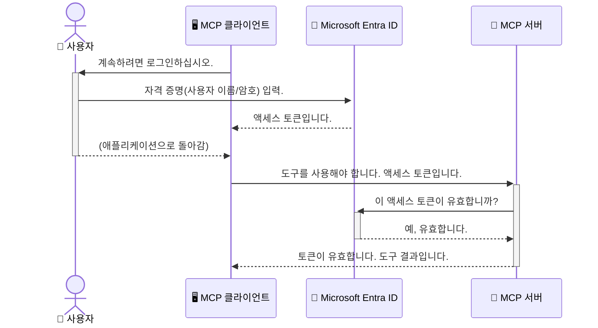

# AI 워크플로우 보안: 모델 컨텍스트 프로토콜 서버를 위한 Entra ID 인증

## 소개
모델 컨텍스트 프로토콜(MCP) 서버를 보호하는 것은 집의 현관문을 잠그는 것만큼 중요합니다. MCP 서버를 열어두면 도구와 데이터가 무단 액세스에 노출되어 보안 침해로 이어질 수 있습니다. Microsoft Entra ID는 강력한 클라우드 기반 ID 및 액세스 관리 솔루션을 제공하여, 승인된 사용자 및 애플리케이션만 MCP 서버와 상호 작용할 수 있도록 보장합니다. 이 섹션에서는 Entra ID 인증을 사용하여 AI 워크플로우를 보호하는 방법을 배웁니다.

## 학습 목표
이 섹션을 마치면 다음을 수행할 수 있습니다:

- MCP 서버 보안의 중요성 이해
- Microsoft Entra ID 및 OAuth 2.0 인증의 기본 사항 설명
- 공개 클라이언트와 기밀 클라이언트의 차이점 인식
- 로컬(공개 클라이언트) 및 원격(기밀 클라이언트) MCP 서버 시나리오 모두에서 Entra ID 인증 구현
- AI 워크플로우 개발 시 보안 모범 사례 적용

## 보안 및 MCP

집의 현관문을 잠그지 않고 두지 않는 것처럼, MCP 서버를 누구에게나 열어두어서는 안 됩니다. AI 워크플로우를 보호하는 것은 강력하고 신뢰할 수 있으며 안전한 애플리케이션을 구축하는 데 필수적입니다. 이 장에서는 Microsoft Entra ID를 사용하여 MCP 서버를 보호하고, 승인된 사용자 및 애플리케이션만 도구 및 데이터와 상호 작용할 수 있도록 하는 방법을 소개합니다.

## MCP 서버에 보안이 중요한 이유

MCP 서버에 이메일을 보내거나 고객 데이터베이스에 액세스할 수 있는 도구가 있다고 상상해 보십시오. 보안되지 않은 서버는 누구나 해당 도구를 잠재적으로 사용할 수 있음을 의미하며, 이는 무단 데이터 액세스, 스팸 또는 기타 악의적인 활동으로 이어질 수 있습니다.

인증을 구현함으로써 서버에 대한 모든 요청이 확인되고, 요청을 하는 사용자 또는 애플리케이션의 ID가 확인됩니다. 이는 AI 워크플로우를 보호하는 첫 번째이자 가장 중요한 단계입니다.

## Microsoft Entra ID 소개

[**Microsoft Entra ID**](https://adoption.microsoft.com/microsoft-security/entra/)는 클라우드 기반 ID 및 액세스 관리 서비스입니다. 애플리케이션을 위한 범용 보안 요원이라고 생각하십시오. 사용자 ID를 확인(인증)하고 허용된 작업을 결정(권한 부여)하는 복잡한 프로세스를 처리합니다.

Entra ID를 사용하면 다음을 수행할 수 있습니다:

- 사용자를 위한 안전한 로그인 활성화
- API 및 서비스 보호
- 중앙 위치에서 액세스 정책 관리

MCP 서버의 경우 Entra ID는 서버 기능에 액세스할 수 있는 사람을 관리하기 위한 강력하고 널리 신뢰받는 솔루션을 제공합니다.

---

## 마법 이해: Entra ID 인증 작동 방식

Entra ID는 **OAuth 2.0**과 같은 개방형 표준을 사용하여 인증을 처리합니다. 세부 사항은 복잡할 수 있지만 핵심 개념은 간단하며 비유를 통해 이해할 수 있습니다.

### OAuth 2.0에 대한 간략한 소개: 발렛 키

OAuth 2.0을 자동차 발렛 서비스와 같다고 생각하십시오. 레스토랑에 도착했을 때 발렛에게 마스터 키를 주지 않습니다. 대신 제한된 권한을 가진 **발렛 키**를 제공합니다. 이 키는 시동을 걸고 문을 잠글 수 있지만 트렁크나 글러브 박스를 열 수는 없습니다.

이 비유에서:

- **당신**은 **사용자**입니다.
- **당신의 자동차**는 귀중한 도구와 데이터를 가진 **MCP 서버**입니다.
- **발렛**은 **Microsoft Entra ID**입니다.
- **주차 요원**은 **MCP 클라이언트** (서버에 액세스하려는 애플리케이션)입니다.
- **발렛 키**는 **액세스 토큰**입니다.

액세스 토큰은 MCP 클라이언트가 로그인 후 Entra ID로부터 받는 안전한 텍스트 문자열입니다. 클라이언트는 모든 요청과 함께 이 토큰을 MCP 서버에 제시합니다. 서버는 토큰을 확인하여 요청이 합법적이고 클라이언트가 필요한 권한을 가지고 있는지 확인할 수 있으며, 실제 자격 증명(예: 암호)을 처리할 필요가 없습니다.

### 인증 흐름

다음은 실제 프로세스 작동 방식입니다:



### Microsoft 인증 라이브러리(MSAL) 소개

코드를 살펴보기 전에 예시에서 보게 될 핵심 구성 요소인 **Microsoft 인증 라이브러리(MSAL)**를 소개하는 것이 중요합니다.

MSAL은 개발자가 인증을 훨씬 쉽게 처리할 수 있도록 Microsoft에서 개발한 라이브러리입니다. 보안 토큰 처리, 로그인 관리 및 세션 새로 고침과 같은 복잡한 코드를 모두 작성할 필요 없이 MSAL이 어려운 작업을 처리합니다.

MSAL과 같은 라이브러리를 사용하는 것이 강력히 권장되는 이유는 다음과 같습니다:

- **안전합니다:** 업계 표준 프로토콜 및 보안 모범 사례를 구현하여 코드의 취약성 위험을 줄입니다.
- **개발을 단순화합니다:** OAuth 2.0 및 OpenID Connect 프로토콜의 복잡성을 추상화하여 몇 줄의 코드만으로 애플리케이션에 강력한 인증을 추가할 수 있습니다.
- **유지 관리됩니다:** Microsoft는 새로운 보안 위협 및 플랫폼 변경 사항을 해결하기 위해 MSAL을 적극적으로 유지 관리하고 업데이트합니다.

MSAL은 .NET, JavaScript/TypeScript, Python, Java, Go 및 iOS 및 Android와 같은 모바일 플랫폼을 포함한 다양한 언어 및 애플리케이션 프레임워크를 지원합니다. 즉, 전체 기술 스택에서 동일한 일관된 인증 패턴을 사용할 수 있습니다.

MSAL에 대해 자세히 알아보려면 공식 [MSAL 개요 문서](https://learn.microsoft.com/entra/identity-platform/msal-overview)를 참조하십시오.

---

## Entra ID로 MCP 서버 보호: 단계별 가이드

이제 Entra ID를 사용하여 로컬 MCP 서버(`stdio`를 통해 통신하는 서버)를 보호하는 방법을 살펴보겠습니다. 이 예시는 데스크톱 앱 또는 로컬 개발 서버와 같이 사용자 컴퓨터에서 실행되는 애플리케이션에 적합한 **공개 클라이언트**를 사용합니다.

### 시나리오 1: 로컬 MCP 서버 보호 (공개 클라이언트 사용)

이 시나리오에서는 로컬에서 실행되고 `stdio`를 통해 통신하며, 도구에 대한 액세스를 허용하기 전에 사용자를 인증하기 위해 Entra ID를 사용하는 MCP 서버를 살펴봅니다. 서버에는 Microsoft Graph API에서 사용자 프로필 정보를 가져오는 단일 도구가 있습니다.

#### 1. Entra ID에서 애플리케이션 설정

코드를 작성하기 전에 Microsoft Entra ID에 애플리케이션을 등록해야 합니다. 이는 Entra ID에 애플리케이션에 대해 알리고 인증 서비스를 사용할 권한을 부여합니다.

1. **[Microsoft Entra 포털](https://entra.microsoft.com/)**로 이동합니다.
2. **앱 등록**으로 이동하여 **새 등록**을 클릭합니다.
3. 애플리케이션에 이름 지정 (예: "내 로컬 MCP 서버").
4. **지원되는 계정 유형**의 경우 **이 조직 디렉터리의 계정만**을 선택합니다.
5. 이 예시에서는 **리디렉션 URI**를 비워둘 수 있습니다.
6. **등록**을 클릭합니다.

등록되면 **애플리케이션(클라이언트) ID** 및 **디렉터리(테넌트) ID**를 기록해 두십시오. 코드에서 필요합니다.

#### 2. 코드: 분석

인증을 처리하는 코드의 주요 부분을 살펴보겠습니다. 이 예시의 전체 코드는 [mcp-auth-servers GitHub 저장소](https://github.com/Azure-Samples/mcp-auth-servers)의 [Entra ID - Local - WAM](https://github.com/Azure-Samples/mcp-auth-servers/tree/main/src/entra-id-local-wam) 폴더에서 사용할 수 있습니다.

**`AuthenticationService.cs`**

이 클래스는 Entra ID와의 상호 작용을 처리합니다.

- **`CreateAsync`**: 이 메서드는 MSAL(Microsoft 인증 라이브러리)에서 `PublicClientApplication`을 초기화합니다. 애플리케이션의 `clientId` 및 `tenantId`로 구성됩니다.
- **`WithBroker`**: 이는 브로커(예: Windows 웹 계정 관리자) 사용을 활성화하여 더 안전하고 원활한 단일 로그인 환경을 제공합니다.
- **`AcquireTokenAsync`**: 이것이 핵심 메서드입니다. 먼저 토큰을 자동으로 가져오려고 시도합니다(유효한 세션이 이미 있는 경우 사용자가 다시 로그인할 필요가 없음을 의미). 자동 토큰을 가져올 수 없으면 사용자에게 대화식으로 로그인하라는 메시지를 표시합니다.

```csharp
// 명확성을 위해 단순화
public static async Task<AuthenticationService> CreateAsync(ILogger<AuthenticationService> logger)
{
    var msalClient = PublicClientApplicationBuilder
        .Create(_clientId) // 애플리케이션(클라이언트) ID
        .WithAuthority(AadAuthorityAudience.AzureAdMyOrg)
        .WithTenantId(_tenantId) // 디렉터리(테넌트) ID
        .WithBroker(new BrokerOptions(BrokerOptions.OperatingSystems.Windows))
        .Build();

    // ... 캐시 등록 ...

    return new AuthenticationService(logger, msalClient);
}

public async Task<string> AcquireTokenAsync()
{
    try
    {
        // 먼저 자동 인증 시도
        var accounts = await _msalClient.GetAccountsAsync();
        var account = accounts.FirstOrDefault();

        AuthenticationResult? result = null;

        if (account != null)
        {
            result = await _msalClient.AcquireTokenSilent(_scopes, account).ExecuteAsync();
        }
        else
        {
            // 계정이 없거나 자동 인증이 실패하면 대화식으로 진행
            result = await _msalClient.AcquireTokenInteractive(_scopes).ExecuteAsync();
        }

        return result.AccessToken;
    }
    catch (Exception ex)
    {
        _logger.LogError(ex, "토큰 획득 중 오류가 발생했습니다.");
        throw; // 선택적으로 상위 수준 처리를 위해 예외 다시 throw
    }
}
```

**`Program.cs`**

여기에서 MCP 서버가 설정되고 인증 서비스가 통합됩니다.

- **`AddSingleton<AuthenticationService>`**: 이는 `AuthenticationService`를 종속성 주입 컨테이너에 등록하여 애플리케이션의 다른 부분(예: 도구)에서 사용할 수 있도록 합니다.
- **`GetUserDetailsFromGraph` 도구**: 이 도구는 `AuthenticationService` 인스턴스를 필요로 합니다. 작업을 수행하기 전에 `authService.AcquireTokenAsync()`를 호출하여 유효한 액세스 토큰을 가져옵니다. 인증이 성공하면 토큰을 사용하여 Microsoft Graph API를 호출하고 사용자 세부 정보를 가져옵니다.

```csharp
// 명확성을 위해 단순화
[McpServerTool(Name = "GetUserDetailsFromGraph")]
public static async Task<string> GetUserDetailsFromGraph(
    AuthenticationService authService)
{
    try
    {
        // 인증 흐름을 트리거합니다.
        var accessToken = await authService.AcquireTokenAsync();

        // 토큰을 사용하여 GraphServiceClient 생성
        var graphClient = new GraphServiceClient(
            new BaseBearerTokenAuthenticationProvider(new TokenProvider(authService)));

        var user = await graphClient.Me.GetAsync();

        return System.Text.Json.JsonSerializer.Serialize(user);
    }
    catch (Exception ex)
    {
        return $"오류: {ex.Message}";
    }
}
```

#### 3. 모든 것이 함께 작동하는 방식

1. MCP 클라이언트가 `GetUserDetailsFromGraph` 도구를 사용하려고 하면 도구는 먼저 `AcquireTokenAsync`를 호출합니다.
2. `AcquireTokenAsync`는 MSAL 라이브러리가 유효한 토큰을 확인하도록 트리거합니다.
3. 토큰을 찾을 수 없으면 MSAL은 브로커를 통해 사용자에게 Entra ID 계정으로 로그인하라는 메시지를 표시합니다.
4. 사용자가 로그인하면 Entra ID는 액세스 토큰을 발급합니다.
5. 도구는 토큰을 수신하고 이를 사용하여 Microsoft Graph API에 대한 보안 호출을 수행합니다.
6. 사용자 세부 정보가 MCP 클라이언트에 반환됩니다.

이 프로세스는 인증된 사용자만 도구를 사용할 수 있도록 보장하여 로컬 MCP 서버를 효과적으로 보호합니다.

### 시나리오 2: 원격 MCP 서버 보호 (기밀 클라이언트 사용)

MCP 서버가 원격 머신(예: 클라우드 서버)에서 실행되고 HTTP 스트리밍과 같은 프로토콜을 통해 통신하는 경우 보안 요구 사항이 다릅니다. 이 경우 **기밀 클라이언트**와 **권한 부여 코드 흐름**을 사용해야 합니다. 이는 애플리케이션의 비밀이 브라우저에 노출되지 않으므로 더 안전한 방법입니다.

이 예시는 Express.js를 사용하여 HTTP 요청을 처리하는 TypeScript 기반 MCP 서버를 사용합니다.

#### 1. Entra ID에서 애플리케이션 설정

Entra ID의 설정은 공개 클라이언트와 유사하지만 한 가지 주요 차이점이 있습니다. **클라이언트 비밀**을 생성해야 합니다.

1. **[Microsoft Entra 포털](https://entra.microsoft.com/)**로 이동합니다.
2. 앱 등록에서 **인증서 및 비밀** 탭으로 이동합니다.
3. **새 클라이언트 비밀**을 클릭하고 설명을 입력한 다음 **추가**를 클릭합니다.
4. **중요:** 비밀 값을 즉시 복사하십시오. 다시 볼 수 없습니다.
5. **리디렉션 URI**도 구성해야 합니다. **인증** 탭으로 이동하여 **플랫폼 추가**를 클릭하고 **웹**을 선택한 다음 애플리케이션의 리디렉션 URI를 입력합니다(예: `http://localhost:3001/auth/callback`).

> **⚠️ 중요 보안 참고:** 프로덕션 애플리케이션의 경우 Microsoft는 클라이언트 비밀 대신 **관리 ID** 또는 **워크로드 ID 페더레이션**과 같은 **비밀 없는 인증** 방법을 사용하는 것을 강력히 권장합니다. 클라이언트 비밀은 노출되거나 손상될 수 있으므로 보안 위험을 초래합니다. 관리 ID는 코드 또는 구성에 자격 증명을 저장할 필요를 없애서 더 안전한 접근 방식을 제공합니다.
>
> 관리 ID 및 구현 방법에 대한 자세한 내용은 [Azure 리소스에 대한 관리 ID 개요](https://learn.microsoft.com/entra/identity/managed-identities-azure-resources/overview)를 참조하십시오.

#### 2. 코드: 분석

이 예시는 세션 기반 접근 방식을 사용합니다. 사용자가 인증하면 서버는 액세스 토큰과 새로 고침 토큰을 세션에 저장하고 사용자에게 세션 토큰을 제공합니다. 이 세션 토큰은 이후 요청에 사용됩니다. 이 예시의 전체 코드는 [mcp-auth-servers GitHub 저장소](https://github.com/Azure-Samples/mcp-auth-servers)의 [Entra ID - Confidential client](https://github.com/Azure-Samples/mcp-auth-servers/tree/main/src/entra-id-cca-session) 폴더에서 사용할 수 있습니다.

**`Server.ts`**

이 파일은 Express 서버와 MCP 전송 계층을 설정합니다.

- **`requireBearerAuth`**: `/sse` 및 `/message` 엔드포인트를 보호하는 미들웨어입니다. 요청의 `Authorization` 헤더에 유효한 베어러 토큰이 있는지 확인합니다.
- **`EntraIdServerAuthProvider`**: `McpServerAuthorizationProvider` 인터페이스를 구현하는 사용자 지정 클래스입니다. OAuth 2.0 흐름을 처리합니다.
- **`/auth/callback`**: 이 엔드포인트는 사용자가 인증한 후 Entra ID의 리디렉션을 처리합니다. 권한 부여 코드를 액세스 토큰 및 새로 고침 토큰으로 교환합니다.

```typescript
// 명확성을 위해 단순화
const app = express();
const { server } = createServer();
const provider = new EntraIdServerAuthProvider();

// SSE 엔드포인트 보호
app.get("/sse", requireBearerAuth({
  provider,
  requiredScopes: ["User.Read"]
}), async (req, res) => {
  // ... 전송에 연결 ...
});

// 메시지 엔드포인트 보호
app.post("/message", requireBearerAuth({
  provider,
  requiredScopes: ["User.Read"]
}), async (req, res) => {
  // ... 메시지 처리 ...
});

// OAuth 2.0 콜백 처리
app.get("/auth/callback", (req, res) => {
  provider.handleCallback(req.query.code, req.query.state)
    .then(result => {
      // ... 성공 또는 실패 처리 ...
    });
});
```

**`Tools.ts`**

이 파일은 MCP 서버가 제공하는 도구를 정의합니다. `getUserDetails` 도구는 이전 예시와 유사하지만 세션에서 액세스 토큰을 가져옵니다.

```typescript
// 명확성을 위해 단순화
server.setRequestHandler(CallToolRequestSchema, async (request) => {
  const { name } = request.params;
  const context = request.params?.context as { token?: string } | undefined;
  const sessionToken = context?.token;

  if (name === ToolName.GET_USER_DETAILS) {
    if (!sessionToken) {
      throw new AuthenticationError("인증 토큰이 없거나 유효하지 않습니다. 요청 컨텍스트에 토큰이 제공되었는지 확인하십시오.");
    }

    // 세션 저장소에서 Entra ID 토큰 가져오기
    const tokenData = tokenStore.getToken(sessionToken);
    const entraIdToken = tokenData.accessToken;

    const graphClient = Client.init({
      authProvider: (done) => {
        done(null, entraIdToken);
      }
    });

    const user = await graphClient.api('/me').get();

    // ... 사용자 세부 정보 반환 ...
  }
});
```

**`auth/EntraIdServerAuthProvider.ts`**

이 클래스는 다음 논리를 처리합니다:

- 사용자 Entra ID 로그인 페이지로 리디렉션
- 권한 부여 코드를 액세스 토큰으로 교환
- `tokenStore`에 토큰 저장
- 액세스 토큰 만료 시 새로 고침

#### 3. 모든 것이 함께 작동하는 방식

1. 사용자가 MCP 서버에 처음 연결하려고 하면 `requireBearerAuth` 미들웨어는 유효한 세션이 없음을 확인하고 Entra ID 로그인 페이지로 리디렉션합니다.
2. 사용자는 Entra ID 계정으로 로그인합니다.
3. Entra ID는 권한 부여 코드와 함께 사용자를 `/auth/callback` 엔드포인트로 다시 리디렉션합니다.
4. 서버는 코드를 액세스 토큰 및 새로 고침 토큰으로 교환하고, 이를 저장하고, 클라이언트에 전송되는 세션 토큰을 생성합니다.
5. 클라이언트는 이제 이 세션 토큰을 MCP 서버에 대한 모든 향후 요청에 대한 `Authorization` 헤더에서 사용할 수 있습니다.
6. `getUserDetails` 도구가 호출되면 세션 토큰을 사용하여 Entra ID 액세스 토큰을 조회한 다음 이를 사용하여 Microsoft Graph API를 호출합니다.

이 흐름은 공개 클라이언트 흐름보다 복잡하지만 인터넷에 노출되는 엔드포인트에 필요합니다. 원격 MCP 서버는 공용 인터넷을 통해 액세스할 수 있으므로 무단 액세스 및 잠재적 공격으로부터 보호하기 위해 더 강력한 보안 조치가 필요합니다.


## 보안 모범 사례

- **항상 HTTPS 사용**: 클라이언트와 서버 간의 통신을 암호화하여 토큰이 가로채이는 것을 방지합니다.
- **역할 기반 액세스 제어(RBAC) 구현**: 사용자가 인증되었는지 여부만 확인하지 말고, *무엇을* 할 수 있는지 확인하십시오. Entra ID에서 역할을 정의하고 MCP 서버에서 이를 확인할 수 있습니다.
- **모니터링 및 감사**: 모든 인증 이벤트를 로깅하여 의심스러운 활동을 감지하고 대응할 수 있도록 합니다.
- **속도 제한 및 스로틀링 처리**: Microsoft Graph 및 기타 API는 남용을 방지하기 위해 속도 제한을 구현합니다. MCP 서버에서 지수 백오프 및 재시도 논리를 구현하여 HTTP 429 (요청이 너무 많음) 응답을 우아하게 처리하십시오. 자주 액세스하는 데이터를 캐싱하여 API 호출을 줄이는 것을 고려하십시오.
- **안전한 토큰 저장**: 액세스 토큰 및 새로 고침 토큰을 안전하게 저장하십시오. 로컬 애플리케이션의 경우 시스템의 보안 저장 메커니즘을 사용하십시오. 서버 애플리케이션의 경우 암호화된 저장소 또는 Azure Key Vault와 같은 보안 키 관리 서비스를 사용하는 것을 고려하십시오.
- **토큰 만료 처리**: 액세스 토큰은 수명이 제한적입니다. 새로 고침 토큰을 사용하여 자동 토큰 새로 고침을 구현하여 다시 인증할 필요 없이 원활한 사용자 경험을 유지하십시오.
- **Azure API Management 사용 고려**: MCP 서버에서 직접 보안을 구현하면 세분화된 제어를 할 수 있지만, Azure API Management와 같은 API 게이트웨이는 인증, 권한 부여, 속도 제한 및 모니터링을 포함한 이러한 보안 문제 중 많은 부분을 자동으로 처리할 수 있습니다. 클라이언트와 MCP 서버 사이에 위치하는 중앙 집중식 보안 계층을 제공합니다. MCP와 함께 API 게이트웨이를 사용하는 방법에 대한 자세한 내용은 [Azure API Management MCP 서버를 위한 인증 게이트웨이](https://techcommunity.microsoft.com/blog/integrationsonazureblog/azure-api-management-your-auth-gateway-for-mcp-servers/4402690)를 참조하십시오.


## 핵심 요약

- MCP 서버 보안은 데이터 및 도구를 보호하는 데 중요합니다.
- Microsoft Entra ID는 인증 및 권한 부여를 위한 강력하고 확장 가능한 솔루션을 제공합니다.
- 로컬 애플리케이션에는 **공개 클라이언트**를 사용하고 원격 서버에는 **기밀 클라이언트**를 사용하십시오.
- **권한 부여 코드 흐름**은 웹 애플리케이션에 가장 안전한 옵션입니다.


## 연습

1. 구축할 MCP 서버에 대해 생각해 보십시오. 로컬 서버입니까, 아니면 원격 서버입니까?
2. 답변을 바탕으로 공개 클라이언트 또는 기밀 클라이언트를 사용하시겠습니까?
3. MCP 서버는 Microsoft Graph에 대한 작업을 수행하기 위해 어떤 권한을 요청합니까?


## 실습

### 연습 1: Entra ID에 애플리케이션 등록
Microsoft Entra 포털로 이동합니다.
MCP 서버용 새 애플리케이션을 등록합니다.
애플리케이션(클라이언트) ID 및 디렉터리(테넌트) ID를 기록합니다.

### 연습 2: 로컬 MCP 서버 보호 (공개 클라이언트)
- 코드 예시를 따라 사용자 인증을 위해 MSAL(Microsoft 인증 라이브러리)을 통합합니다.
- Microsoft Graph에서 사용자 세부 정보를 가져오는 MCP 도구를 호출하여 인증 흐름을 테스트합니다.

### 연습 3: 원격 MCP 서버 보호 (기밀 클라이언트)
- Entra ID에 기밀 클라이언트를 등록하고 클라이언트 비밀을 생성합니다.
- Express.js MCP 서버가 권한 부여 코드 흐름을 사용하도록 구성합니다.
- 보호된 엔드포인트를 테스트하고 토큰 기반 액세스를 확인합니다.

### 연습 4: 보안 모범 사례 적용
- 로컬 또는 원격 서버에 HTTPS를 활성화합니다.
- 서버 논리에 역할 기반 액세스 제어(RBAC)를 구현합니다.
- 토큰 만료 처리 및 안전한 토큰 저장을 추가합니다.

## 자료

1. **MSAL 개요 문서**
   Microsoft 인증 라이브러리(MSAL)가 플랫폼 전반에 걸쳐 안전한 토큰 획득을 가능하게 하는 방법을 배웁니다:
   [Microsoft Learn의 MSAL 개요](https://learn.microsoft.com/en-gb/entra/msal/overview)

2. **Azure-Samples/mcp-auth-servers GitHub 저장소**
   인증 흐름을 보여주는 MCP 서버의 참조 구현:
   [GitHub의 Azure-Samples/mcp-auth-servers](https://github.com/Azure-Samples/mcp-auth-servers)

3. **Azure 리소스에 대한 관리 ID 개요**
   시스템 또는 사용자 할당 관리 ID를 사용하여 비밀을 제거하는 방법을 이해합니다:
   [Microsoft Learn의 관리 ID 개요](https://learn.microsoft.com/en-us/entra/identity/managed-identities-azure-resources/)

4. **Azure API Management: MCP 서버를 위한 인증 게이트웨이**
   APIM을 MCP 서버를 위한 안전한 OAuth2 게이트웨이로 사용하는 방법에 대한 심층 분석:
   [Azure API Management MCP 서버를 위한 인증 게이트웨이](https://techcommunity.microsoft.com/blog/integrationsonazureblog/azure-api-management-your-auth-gateway-for-mcp-servers/4402690)

5. **Microsoft Graph 권한 참조**
   Microsoft Graph에 대한 위임된 및 애플리케이션 권한의 포괄적인 목록:
   [Microsoft Graph 권한 참조](https://learn.microsoft.com/zh-tw/graph/permissions-reference)


## 학습 결과
이 섹션을 완료하면 다음을 수행할 수 있습니다:

- MCP 서버 및 AI 워크플로우에 인증이 중요한 이유를 명확하게 설명
- 로컬 및 원격 MCP 서버 시나리오 모두에 대한 Entra ID 인증 설정 및 구성
- 서버 배포에 따라 적절한 클라이언트 유형(공개 또는 기밀) 선택
- 토큰 저장 및 역할 기반 권한 부여를 포함한 보안 코딩 사례 구현
- MCP 서버 및 도구를 무단 액세스로부터 자신 있게 보호

## 다음 단계

- [5.13 Azure AI Foundry와 모델 컨텍스트 프로토콜(MCP) 통합](../mcp-foundry-agent-integration/README.md)
