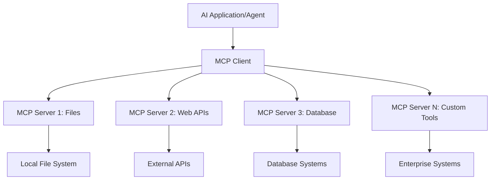

# 🌐 모듈 2: AI 툴킷 기본 사항을 활용한 MCP

[]()
[]()
[]()

## 📋 학습 목표

이 모듈을 마치면 다음을 할 수 있습니다:
- ✅ MCP(모델 컨텍스트 프로토콜) 아키텍처 및 이점 이해
- ✅ Microsoft의 MCP 서버 생태계 탐색
- ✅ AI 툴킷 에이전트 빌더와 MCP 서버 통합
- ✅ Playwright MCP를 사용하여 기능적인 브라우저 자동화 에이전트 구축
- ✅ 에이전트 내에서 MCP 도구 구성 및 테스트
- ✅ 프로덕션 사용을 위해 MCP 기반 에이전트 내보내기 및 배포

## 🎯 모듈 1 기반 구축

모듈 1에서는 AI 툴킷의 기본 사항을 익히고 첫 번째 Python 에이전트를 만들었습니다. 이제 혁신적인 **MCP(모델 컨텍스트 프로토콜)**를 통해 에이전트를 외부 도구 및 서비스에 연결하여 에이전트를 **강력하게** 만들 것입니다.

이것은 기본 계산기에서 완전한 컴퓨터로 업그레이드하는 것과 같습니다. AI 에이전트는 다음 기능을 얻게 됩니다:
- 🌐 웹사이트 탐색 및 상호 작용
- 📁 파일 액세스 및 조작
- 🔧 엔터프라이즈 시스템과 통합
- 📊 API에서 실시간 데이터 처리

## 🧠 MCP(모델 컨텍스트 프로토콜) 이해

### 🔍 MCP란 무엇인가요?

모델 컨텍스트 프로토콜(MCP)은 **"AI 애플리케이션을 위한 USB-C"**입니다. 즉, LLM(대규모 언어 모델)을 외부 도구, 데이터 소스 및 서비스에 연결하는 혁신적인 개방형 표준입니다. USB-C가 하나의 범용 커넥터를 제공하여 케이블 혼란을 없앤 것처럼, MCP는 하나의 표준화된 프로토콜로 AI 통합 복잡성을 제거합니다.

### 🎯 MCP가 해결하는 문제

**MCP 이전:**
- 🔧 모든 도구에 대한 사용자 지정 통합
- 🔄 독점 솔루션으로 인한 공급업체 종속
- 🔒 임시 연결로 인한 보안 취약성
- ⏱️ 기본 통합을 위한 수개월의 개발 시간

**MCP 사용 시:**
- ⚡ 플러그 앤 플레이 도구 통합
- 🔄 공급업체에 구애받지 않는 아키텍처
- 🛡️ 내장된 보안 모범 사례
- 🚀 몇 분 만에 새로운 기능 추가

### 🏗️ MCP 아키텍처 심층 분석

MCP는 안전하고 확장 가능한 생태계를 만드는 **클라이언트-서버 아키텍처**를 따릅니다:



**🔧 핵심 구성 요소:**

| 구성 요소 | 역할 | 예시 |
|-----------|------|----------|
| **MCP 호스트** | MCP 서비스를 사용하는 애플리케이션 | Claude Desktop, VS Code, AI Toolkit |
| **MCP 클라이언트** | 프로토콜 핸들러 (서버와 1:1) | 호스트 애플리케이션에 내장 |
| **MCP 서버** | 표준 프로토콜을 통해 기능 노출 | Playwright, Files, Azure, GitHub |
| **전송 계층** | 통신 방법 | stdio, HTTP, WebSockets |


## 🏢 Microsoft의 MCP 서버 생태계

Microsoft는 실제 비즈니스 요구 사항을 해결하는 포괄적인 엔터프라이즈급 서버 제품군으로 MCP 생태계를 선도합니다.

### 🌟 주요 Microsoft MCP 서버

#### 1. ☁️ Azure MCP 서버
**🔗 저장소**: [azure/azure-mcp](https://github.com/azure/azure-mcp)
**🎯 목적**: AI 통합을 통한 포괄적인 Azure 리소스 관리

**✨ 주요 기능:**
- 선언적 인프라 프로비저닝
- 실시간 리소스 모니터링
- 비용 최적화 권장 사항
- 보안 규정 준수 확인

**🚀 사용 사례:**
- AI 지원을 통한 코드형 인프라
- 자동화된 리소스 스케일링
- 클라우드 비용 최적화
- DevOps 워크플로 자동화

#### 2. 📊 Microsoft Dataverse MCP
**📚 문서**: [Microsoft Dataverse 통합](https://go.microsoft.com/fwlink/?linkid=2320176)
**🎯 목적**: 비즈니스 데이터를 위한 자연어 인터페이스

**✨ 주요 기능:**
- 자연어 데이터베이스 쿼리
- 비즈니스 컨텍스트 이해
- 사용자 지정 프롬프트 템플릿
- 엔터프라이즈 데이터 거버넌스

**🚀 사용 사례:**
- 비즈니스 인텔리전스 보고
- 고객 데이터 분석
- 영업 파이프라인 통찰력
- 규정 준수 데이터 쿼리

#### 3. 🌐 Playwright MCP 서버
**🔗 저장소**: [microsoft/playwright-mcp](https://github.com/microsoft/playwright-mcp)
**🎯 목적**: 브라우저 자동화 및 웹 상호 작용 기능

**✨ 주요 기능:**
- 크로스 브라우저 자동화 (Chrome, Firefox, Safari)
- 지능형 요소 감지
- 스크린샷 및 PDF 생성
- 네트워크 트래픽 모니터링

**🚀 사용 사례:**
- 자동화된 테스트 워크플로
- 웹 스크래핑 및 데이터 추출
- UI/UX 모니터링
- 경쟁 분석 자동화

#### 4. 📁 Files MCP 서버
**🔗 저장소**: [microsoft/files-mcp-server](https://github.com/microsoft/files-mcp-server)
**🎯 목적**: 지능형 파일 시스템 작업

**✨ 주요 기능:**
- 선언적 파일 관리
- 콘텐츠 동기화
- 버전 제어 통합
- 메타데이터 추출

**🚀 사용 사례:**
- 문서 관리
- 코드 저장소 구성
- 콘텐츠 게시 워크플로
- 데이터 파이프라인 파일 처리

#### 5. 📝 MarkItDown MCP 서버
**🔗 저장소**: [microsoft/markitdown](https://github.com/microsoft/markitdown)
**🎯 목적**: 고급 마크다운 처리 및 조작

**✨ 주요 기능:**
- 풍부한 마크다운 구문 분석
- 형식 변환 (MD ↔ HTML ↔ PDF)
- 콘텐츠 구조 분석
- 템플릿 처리

**🚀 사용 사례:**
- 기술 문서 워크플로
- 콘텐츠 관리 시스템
- 보고서 생성
- 지식 기반 자동화

#### 6. 📈 Clarity MCP 서버
**📦 패키지**: [@microsoft/clarity-mcp-server](https://www.npmjs.com/package/@microsoft/clarity-mcp-server)
**🎯 목적**: 웹 분석 및 사용자 행동 통찰력

**✨ 주요 기능:**
- 히트맵 데이터 분석
- 사용자 세션 기록
- 성능 지표
- 전환 깔때기 분석

**🚀 사용 사례:**
- 웹사이트 최적화
- 사용자 경험 연구
- A/B 테스트 분석
- 비즈니스 인텔리전스 대시보드

### 🌍 커뮤니티 생태계

Microsoft 서버 외에도 MCP 생태계에는 다음이 포함됩니다:
- **🐙 GitHub MCP**: 저장소 관리 및 코드 분석
- **🗄️ 데이터베이스 MCP**: PostgreSQL, MySQL, MongoDB 통합
- **☁️ 클라우드 공급자 MCP**: AWS, GCP, Digital Ocean 도구
- **📧 통신 MCP**: Slack, Teams, 이메일 통합

## 🛠️ 실습: 브라우저 자동화 에이전트 구축

**🎯 프로젝트 목표**: 웹사이트를 탐색하고, 정보를 추출하고, 복잡한 웹 상호 작용을 수행할 수 있는 Playwright MCP 서버를 사용하는 지능형 브라우저 자동화 에이전트 만들기.

### 🚀 1단계: 에이전트 기본 설정

#### 1단계: 에이전트 초기화
1. **AI 툴킷 에이전트 빌더 열기**
2. 다음 구성으로 **새 에이전트 만들기**:
   - **이름**: `BrowserAgent`
   - **모델**: GPT-4o 선택


### 🔧 2단계: MCP 통합 워크플로

#### 3단계: MCP 서버 통합 추가
1. 에이전트 빌더의 **도구 섹션으로 이동**
2. 통합 메뉴를 열려면 **"도구 추가" 클릭**
3. 사용 가능한 옵션에서 **"MCP 서버" 선택**


**🔍 도구 유형 이해:**
- **내장 도구**: 미리 구성된 AI 툴킷 기능
- **MCP 서버**: 외부 서비스 통합
- **사용자 지정 API**: 사용자 자신의 서비스 엔드포인트
- **함수 호출**: 직접 모델 함수 액세스

#### 4단계: MCP 서버 선택
1. 계속하려면 **"MCP 서버" 옵션 선택**


2. 사용 가능한 통합을 탐색하려면 **MCP 카탈로그 찾아보기**


### 🎮 3단계: Playwright MCP 구성

#### 5단계: Playwright 선택 및 구성
1. Microsoft의 검증된 서버에 액세스하려면 **"주요 MCP 서버 사용" 클릭**
2. 주요 목록에서 **"Playwright" 선택**
3. **기본 MCP ID 수락** 또는 환경에 맞게 사용자 지정


#### 6단계: Playwright 기능 활성화
**🔑 중요 단계**: 최대 기능을 위해 사용 가능한 **모든** Playwright 메서드를 선택합니다.


**🛠️ 필수 Playwright 도구:**
- **탐색**: `goto`, `goBack`, `goForward`, `reload`
- **상호 작용**: `click`, `fill`, `press`, `hover`, `drag`
- **추출**: `textContent`, `innerHTML`, `getAttribute`
- **유효성 검사**: `isVisible`, `isEnabled`, `waitForSelector`
- **캡처**: `screenshot`, `pdf`, `video`
- **네트워크**: `setExtraHTTPHeaders`, `route`, `waitForResponse`

#### 7단계: 통합 성공 확인
**✅ 성공 지표:**
- 모든 도구가 에이전트 빌더 인터페이스에 나타남
- 통합 패널에 오류 메시지 없음
- Playwright 서버 상태가 "연결됨"으로 표시됨


**🔧 일반적인 문제 해결:**
- **연결 실패**: 인터넷 연결 및 방화벽 설정 확인
- **누락된 도구**: 설정 중에 모든 기능이 선택되었는지 확인
- **권한 오류**: VS Code에 필요한 시스템 권한이 있는지 확인

### 🎯 4단계: 고급 프롬프트 엔지니어링

#### 8단계: 지능형 시스템 프롬프트 설계
Playwright의 모든 기능을 활용하는 정교한 프롬프트 만들기:

```markdown
# 웹 자동화 전문가 시스템 프롬프트

## 핵심 정체성
당신은 브라우저 자동화, 웹 스크래핑 및 사용자 경험 분석에 대한 깊은 전문 지식을 갖춘 고급 웹 자동화 전문가입니다. 포괄적인 브라우저 제어를 위해 Playwright 도구에 액세스할 수 있습니다.

## 기능 및 접근 방식
### 탐색 전략
- 항상 스크린샷으로 시작하여 페이지 레이아웃 이해
- 가능한 경우 의미론적 선택기(텍스트 콘텐츠, 레이블) 사용
- 동적 콘텐츠에 대한 대기 전략 구현
- 단일 페이지 애플리케이션(SPA)을 효과적으로 처리

### 오류 처리
- 지수 백오프를 사용하여 실패한 작업 재시도
- 명확한 오류 설명 및 해결책 제공
- 기본 방법이 실패할 경우 대체 접근 방식 제안
- 오류 발생 시 항상 진단 스크린샷 캡처

### 데이터 추출
- 가능한 경우 JSON 형식으로 구조화된 데이터 추출
- 추출된 정보에 대한 신뢰도 점수 제공
- 데이터 완전성 및 정확성 검증
- 페이지 매김 및 무한 스크롤 시나리오 처리

### 보고
- 단계별 실행 로그 포함
- 확인을 위한 전/후 스크린샷 제공
- 최적화 및 대체 접근 방식 제안
- 발생한 제한 사항 또는 예외 사례 문서화

## 윤리적 지침
- robots.txt 및 속도 제한 준수
- 대상 서버 과부하 방지
- 공개적으로 사용 가능한 정보만 추출
- 웹사이트 서비스 약관 준수
```

#### 9단계: 동적 사용자 프롬프트 만들기
다양한 기능을 보여주는 프롬프트 설계:

**🌐 웹 분석 예시:**
```markdown
github.com/kinfey로 이동하여 다음을 포함한 포괄적인 분석을 제공합니다:
1. 저장소 구조 및 구성
2. 최근 활동 및 기여 패턴
3. 문서 품질 평가
4. 기술 스택 식별
5. 커뮤니티 참여 지표
6. 주목할 만한 프로젝트 및 목적

주요 단계에서 스크린샷을 포함하고 실행 가능한 통찰력을 제공합니다.
```


### 🚀 5단계: 실행 및 테스트

#### 10단계: 첫 번째 자동화 실행
1. 자동화 시퀀스를 시작하려면 **"실행" 클릭**
2. **실시간 실행 모니터링**:
   - Chrome 브라우저가 자동으로 실행됨
   - 에이전트가 대상 웹사이트로 이동
   - 스크린샷이 각 주요 단계를 캡처함
   - 분석 결과가 실시간으로 스트리밍됨


#### 11단계: 결과 및 통찰력 분석
에이전트 빌더 인터페이스에서 포괄적인 분석 검토:


### 🌟 6단계: 고급 기능 및 배포

#### 12단계: 내보내기 및 프로덕션 배포
에이전트 빌더는 여러 배포 옵션을 지원합니다:


## 🎓 모듈 2 요약 및 다음 단계

### 🏆 달성 완료: MCP 통합 마스터

**✅ 숙련된 기술:**
- [ ] MCP 아키텍처 및 이점 이해
- [ ] Microsoft의 MCP 서버 생태계 탐색
- [ ] AI 툴킷과 Playwright MCP 통합
- [ ] 정교한 브라우저 자동화 에이전트 구축
- [ ] 웹 자동화를 위한 고급 프롬프트 엔지니어링

### 📚 추가 자료

- **🔗 MCP 사양**: [공식 프로토콜 문서](https://modelcontextprotocol.io/)
- **🛠️ Playwright API**: [전체 메서드 참조](https://playwright.dev/docs/api/class-playwright)
- **🏢 Microsoft MCP 서버**: [엔터프라이즈 통합 가이드](https://github.com/microsoft/mcp-servers)
- **🌍 커뮤니티 예시**: [MCP 서버 갤러리](https://github.com/modelcontextprotocol/servers)

**🎉 축하합니다!** MCP 통합을 성공적으로 마스터했으며 이제 외부 도구 기능을 갖춘 프로덕션 준비 AI 에이전트를 구축할 수 있습니다!


### 🔜 다음 모듈로 계속

MCP 기술을 다음 단계로 끌어올릴 준비가 되셨나요? **[모듈 3: AI 툴킷을 사용한 고급 MCP 개발](../lab3/README.md)**로 진행하여 다음을 배우게 됩니다:
- 사용자 지정 MCP 서버 만들기
- 최신 MCP Python SDK 구성 및 사용
- 디버깅을 위한 MCP 검사기 설정
- 고급 MCP 서버 개발 워크플로 마스터
- 처음부터 날씨 MCP 서버 구축